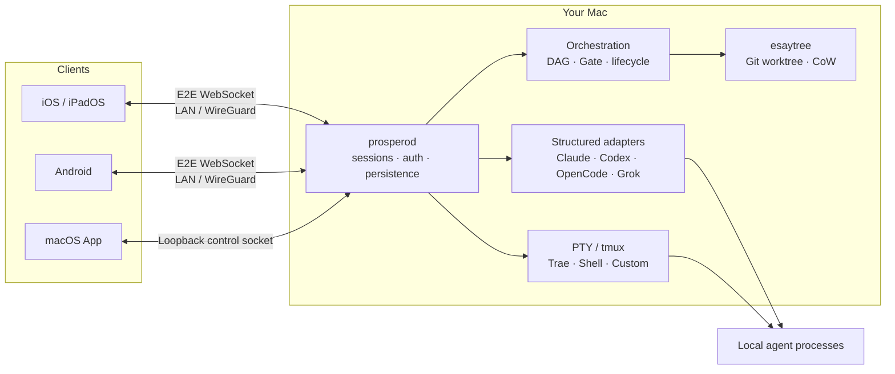

# Prospero

> Local-first control plane for coding agents — run them on your Mac, supervise them from your phone.

Prospero 是一个面向本地 Coding Agent 的控制中枢。Claude Code、Codex、OpenCode、
Grok、Trae 和任意 CLI 仍运行在你自己的 Mac、使用你现有的项目、工具链与账号；
Prospero 负责把会话、审批、终端、文件、Git、用量与多 Agent 编排统一到 macOS、
iOS 和 Android 客户端。

连接默认走局域网或 WireGuard 直达 Mac，不依赖 Prospero 云端账号、托管环境或消息
中转服务。WebSocket 上的业务消息使用应用层端到端加密；离开同一网络时，由你自己的
WireGuard 网络负责可达性。

> [!IMPORTANT]
> Prospero 目前是源码优先的早期项目，还没有面向普通用户的签名安装包或稳定版承诺。
> macOS 主机端、iOS/Android 客户端和核心能力均已实现，但部分真机网络、后台通知、
> 输入法与性能项目仍待更广泛设备验证。请先阅读[当前状态](#当前状态与边界)。

## Prospero 解决什么问题

Coding Agent 已经能长时间独立工作，人的工作逐渐变成：选择任务、查看过程、批准工具、
回答问题、检查 diff，以及在多个 Agent 之间协调依赖。传统远程终端可以让你“看到那块
屏幕”，却不了解 Agent 正在等待批准、询问什么问题，或哪个子任务已经完成；云端 Agent
又往往无法完整复用本机的仓库、证书、MCP、私有工具和已有登录状态。

Prospero 保留本地执行环境，同时提供一层 Agent-aware 的远程控制面：

- 在手机或 Mac App 中创建、恢复、停止和切换会话。
- 原生展示消息、推理、工具调用、diff、审批、提问与子 Agent，而不只是一块终端画面。
- 对没有结构化接口的 CLI 自动回落到 PTY/TUI，不因适配器缺失而失去可用性。
- 在同一个界面查看项目文件、Git 变更、账号额度和所有等待人工处理的会话。
- 用可视化 DAG 拆分任务、设置依赖、派发 worker，并用隔离 worktree 保护主工作区。

## 与常见产品形态的不同

下面按产品形态比较，不针对某个具体品牌。Prospero 的重点不是宣称每个单点能力都独有，
而是把这些选择组合成一个本地优先、跨 Agent、可编排的完整控制面。

| 常见形态 | 通常擅长 | Prospero 的选择 |
| --- | --- | --- |
| 云端 Coding Agent | 关掉电脑后继续运行、团队协作、托管环境 | Agent 留在你的 Mac，直接复用本地仓库、Keychain、MCP、CLI 登录态和完整工具链 |
| 依赖 Relay 的移动伴侣 | 跨公网开箱即用、多设备同步 | 控制链路通过 LAN/WireGuard 直连，不需要 Prospero 账号、云数据库或中转服务器 |
| SSH / Web Terminal | 通用、忠实呈现任意 TUI | 除 PTY 兜底外，还理解审批、提问、工具、diff、模型、模式、队列和子 Agent 等结构化语义 |
| 桌面 Agent 管理器 | 多会话、worktree、桌面端操作密度高 | macOS 与原生移动端共享同一协议和状态；离开桌面后仍能完成关键监督动作 |
| 单 Agent 官方远控 | 与单一 Agent 集成最深 | 同一套 UI 同时覆盖多种 Agent，并用通用 PTY 轨接住未知或尚未适配的 CLI |

Prospero 最核心的差异组合是：

1. **直连而非自建一朵云**：没有 Prospero Relay；网络边界、存储位置和远程接入方式由你掌控。
2. **结构化与 PTY 双轨**：能深度适配时提供原生交互，不能适配时仍保留完整终端能力。
3. **监督与编排是一套系统**：单会话审批、子 Agent 观察、DAG 派发、Gate 和任务生命周期共用同一事实源。
4. **并发从工作区安全开始**：`esaytree` 给 worker 创建干净、可回滚、可复用依赖的隔离工作区。
5. **账号与项目解耦**：同一仓库可使用多个隔离的 Codex/Claude Code 账号，不混用配置与原生会话历史。

## 功能特点

### 1. 一个入口控制多种 Agent

Prospero 的 daemon 同时提供结构化适配器和通用 PTY 适配器：

| Agent / 会话 | 默认形态 | 能力说明 |
| --- | --- | --- |
| Claude Code | 结构化 | 流式对话、工具与审批、提问、diff、会话恢复、图片附件、多账号隔离；也可使用 PTY |
| Codex | 结构化 | app-server 对话、命令/patch 审批、模型与模式、会话恢复、子线程过程、多账号隔离；也可使用 PTY |
| OpenCode | 结构化 | HTTP + SSE 事件流、权限回传、原生会话；也可使用 PTY |
| Grok | PTY | 已提供结构化适配器，但因 headless 审批粒度有限，默认保留可人工交互的 PTY |
| Trae | PTY | 通过交互式 CLI 完整呈现 TUI |
| Shell / Custom | PTY | 启动登录 Shell 或任意自定义命令，相当于复用 Prospero 安全通道的 SSH 替代入口 |

所有会话共享统一的状态模型。Mac、iPhone 与 Android 看到的是同一份会话列表、运行状态、
等待审批项和持久化历史。

### 2. 面向手机重做交互，而不是缩小桌面终端

- 结构化聊天渲染 Markdown、代码、数学公式、推理折叠、工具卡片与文件 diff。
- 审批和 Agent 提问以高优先级卡片呈现，可选择一次允许、持续允许或拒绝。
- Agent 忙碌时可排队下一条消息，或在后端支持时将指令 steer 进当前轮次。
- 可切换模型、Plan/Default 模式和审批策略，并区分“停止本轮”与“结束会话”。
- 子 Agent 有独立身份、状态和历史视图，可直接向指定子 Agent 发送消息。
- 图片可作为对话附件；文件面板支持查看、编辑、上传、下载、重命名和删除。
- Git 面板支持 status、diff、stage/unstage、discard 和 commit。
- 结构化会话提供按住说话的设备端转写；文字只进入草稿，不会自动发送。
- PTY 会话使用 xterm.js、服务端快照和增量输出，支持键盘工具条、缩放与断线恢复。

### 3. LAN / WireGuard 直连与无感恢复

- `prosperod` 监听本机网络，Bonjour 在同一局域网内发现主机。
- 配对二维码一次携带主机身份、候选地址和单设备凭证。
- 客户端并发尝试 Wi-Fi、WireGuard 等历史地址，首个完成加密握手的连接获胜。
- 每个下行事件带单调序号；断线重连后通过快照与增量续传恢复，而不是从头重放。
- PTY 可选由 tmux 托管；daemon 重启后可重新接回仍在运行的终端进程。

Prospero 只解决控制链路，不替代 VPN。跨网络使用时，应先让手机和 Mac 通过 WireGuard、
Tailscale 或等价的私有网络互相可达。

### 4. 可视化多 Agent 编排

Mac App 与移动端都可以创建 Run，在 DAG 画布中添加任务、设置前置依赖，再手工或自动派发
worker。编排层刻意采用显式状态，而不是把“Agent 暂时 idle”猜成“任务已完成”：

- worker 必须显式 `task done`，下游任务才会被释放。
- `cancelled` 不等同于 `done`，取消上游不会错误放行依赖任务。
- Gate 可以暂停任务，等待人工决策后再重新检查依赖与 worker 状态。
- 任务支持停止、取消和失败后重试；人工干预会先暂停自动派发，避免后台立刻覆盖操作。
- `operationId` 保证断线重试幂等，`graphRevision` 阻止 Mac 与手机静默覆盖彼此的编辑。
- 自动运行默认让整张 Run 共用一个隔离 worktree 并安全串行推进，使下游能看到上游累计改动。

目前每任务独立 worktree 的自动合并与冲突处理仍在后续计划中；在它完成前，Prospero 不会
假装隔离分支上的成果已经自动汇合。

### 5. `esaytree`：为 Agent 设计的快速 worktree

`esaytree` 是 Prospero 自研的 worktree 引擎，既被编排系统直接调用，也可作为独立 CLI 使用。

- 从指定 Git ref 的已提交快照开始，源仓 staged、unstaged 和 untracked 改动不会进入 worker。
- 先创建 `--no-checkout` linked worktree，再使用文件系统 CoW 克隆快速复用已有文件。
- 自动识别并复用完全被 Git 忽略的依赖目录，包括 monorepo 内多层 `node_modules`。
- CoW 文件拥有独立 inode，worker 修改不会污染源仓；不支持 CoW 时默认安全回退到普通 checkout。
- 创建失败会回滚 worktree 登记、目录和本次新建的分支；删除前会核对 Git 登记关系。
- 提供稳定 JSON envelope、明确退出码和 `doctor/new/list/switch/rm` 命令。

```bash
npm run typecheck
apps/daemon/bin/esaytree doctor
apps/daemon/bin/esaytree new fix-login
apps/daemon/bin/esaytree list
cd "$(apps/daemon/bin/esaytree switch fix-login)"
apps/daemon/bin/esaytree rm fix-login
```

完整契约见 [`docs/esaytree.md`](docs/esaytree.md)。`esaytree` 是工作区隔离工具，不是安全
沙箱；worker 仍拥有当前 macOS 用户本来就有的文件与进程权限。

### 6. Codex / Claude Code 多账号隔离

Prospero 可新增、重命名、登录、注销、删除账号并设置默认账号。账号和项目是两层独立概念，
多个账号可以同时使用同一个项目路径。

- Codex 账号使用各自的 `CODEX_HOME`。
- Claude Code 账号使用各自的 `CLAUDE_CONFIG_DIR`。
- 配置、原生会话历史、MCP 与插件状态不会在受管账号之间混用。
- 账号元数据只记录名称和隔离目录 ID，不把凭据写入会话或编排持久化文件。
- Claude Code 订阅令牌通过加密配对通道导入，并保存到 Prospero 专用的 macOS Keychain 项。
- 编排 worker 可继承协调者账号，也可在派发时显式选择账号。

## 架构



仓库由四个主要部分组成：

- `apps/daemon`：Node.js 22 / TypeScript 宿主，负责连接、会话、适配器、文件、Git、账号与编排。
- `apps/shell`：SwiftUI macOS 控制中心，负责 daemon 生命周期、Bonjour、本地会话与 TCC 稳定身份。
- `apps/mobile`：Expo / React Native 客户端，iOS 与 Android 共用协议、路由和绝大部分 UI。
- `packages/protocol`：Zod 消息模型、版本协商、配对格式、加密握手与环形增量缓冲。

## 安全与隐私模型

Prospero 的“零云中转”特指 **Prospero 控制面**。Coding Agent 自身仍可能访问其模型提供方，
WireGuard 服务也可能有自己的控制面；可选的 Bark/ntfy 通知同样会把你配置的通知摘要发送到
相应端点。

- 配对二维码包含访问凭证和主机公钥，应像一次性密码一样保护，不要截图外传。
- 每台客户端有独立 token，并在首次握手后绑定客户端公钥；设备可单独撤销。
- 会话密钥由双方临时 X25519 密钥协商，daemon 静态密钥只用于身份证明，提供前向保密。
- 加密帧使用隐式单调 nonce；篡改、乱序或重放会导致解密失败并断开连接。
- daemon 身份、设备表与配置写入 `~/.prospero`，权限为 `0700/0600`。
- 移动端将主机 token 与设备私钥存入系统安全存储；普通地址簿只保留非敏感元数据。
- 配对时可使用 `--no-shell` 和 `--no-orchestration` 限制高权限能力，之后也可撤销设备或轮换主机身份。
- `shell`、`custom` 和 worker Agent 都以当前本地用户权限运行。Prospero 不是容器或恶意代码沙箱。

本项目尚未接受独立安全审计。不要把 daemon 端口直接暴露到公网；远程访问建议放在你控制的
私有网络中，并为不需要完整终端的设备关闭 Shell 权限。

## 环境要求

- macOS 14 或更高版本作为 Agent 主机。
- Node.js 22 或更高版本，npm workspaces。
- 至少安装一个要使用的 Agent CLI；纯 Shell 会话无需额外 Agent。
- iOS 构建需要完整 Xcode；Android 构建需要 JDK 17+ 与 Android SDK 36。
- 可选：tmux，用于 daemon 重启后保活 PTY 会话。
- 可选：WireGuard/Tailscale，用于跨局域网直连。

项目根目录的 `.npmrc` 固定使用 `https://registry.npmjs.org/`，lockfile 中的依赖也全部解析到
公开 npm registry。

## 快速开始

### 1. 安装并构建

```bash
git clone https://github.com/linn0x/Prospero.git
cd Prospero
npm install
npm run typecheck
```

### 2. 启动 Mac daemon

```bash
# 终端 A：启动服务；已安装 tmux 时可追加 --tmux
node apps/daemon/dist/cli.js start

# 终端 B：为一台手机生成二维码
node apps/daemon/dist/cli.js pair --name my-phone
```

如果手机只需要查看结构化会话、不应获得完整 Shell 与编排权限：

```bash
node apps/daemon/dist/cli.js pair --name viewer --no-shell
```

常用安全维护命令：

```bash
node apps/daemon/dist/cli.js status
node apps/daemon/dist/cli.js revoke my-phone
node apps/daemon/dist/cli.js rotate-key
```

### 3. 运行移动端

iOS 真机：

```bash
npm run ios -w @prospero/mobile -- --device
```

Android 开发构建：

```bash
npm run android -w @prospero/mobile
```

Android release 侧载构建：

```bash
npm run build:android -w @prospero/mobile -- --install --launch
```

打开 App 后扫描二维码，允许本地网络访问，进入主机页即可创建 Agent、Shell 或编排会话。
Android 构建与 ntfy 配置详见 [`apps/mobile/README.md`](apps/mobile/README.md)。

### 4. 可选：构建 macOS 控制中心

```bash
./apps/shell/scripts/build-app.sh --run
```

脚本默认复用 Keychain 中的 Apple Development / Developer ID 身份，使 macOS TCC 授权能在
升级后保持稳定。没有开发者证书时，可显式使用一次性的 ad-hoc 构建：

```bash
ALLOW_ADHOC_SIGNING=1 ./apps/shell/scripts/build-app.sh --run
```

## 日常使用路径

1. 在 Mac 或手机选择项目目录和 Agent，创建结构化或 PTY 会话。
2. 离开电脑后，从手机查看进度、回答问题、处理审批或停止当前轮次。
3. 通过文件/Git 面板检查改动；需要任意命令时切到 Shell 会话。
4. 对复杂目标创建 DAG，设置任务依赖与 Gate，再让自动运行器按显式交付顺序推进。
5. 自动编排 worker 默认在 `esaytree` 隔离工作区执行；确认结果后再由人完成合并与清理。

## 开发与验证

```bash
# protocol + daemon 类型检查与构建
npm run typecheck

# 各 workspace 测试
npm test

# 仅移动端 lint / test
npm run lint -w @prospero/mobile
npm test -w @prospero/mobile

# 仅 daemon 测试
npm test -w @prospero/daemon
```

部分 daemon 集成测试会在对应 CLI 和账号可用时启动真实 Agent，耗时与结果可能受外部服务影响。
核心单元测试不要求云端 Agent。

## 当前状态与边界

| 模块 | 状态 |
| --- | --- |
| macOS daemon、加密配对、PTY、结构化会话 | 已实现并有自动测试 |
| SwiftUI macOS 控制中心 | 已实现，可从源码构建 |
| iOS / iPadOS 客户端 | 主路径已实现；真机 TCC、WireGuard 切换、后台恢复和输入法仍需扩大验证 |
| Android 客户端 | release 构建和 API 35 模拟器已验证；中端真机、ROM 后台策略和 mDNS 兼容性待验 |
| 多 Agent DAG 编排 | 手工/自动派发、Gate、停止/取消/重试、图编辑和并发保护已实现 |
| `esaytree` | CLI、TypeScript API、CoW/checkout 路径和失败回滚已有真实 Git 测试 |
| 自动合并独立 worker worktree | 尚未实现；当前自动模式使用共享 Run worktree 串行推进 |
| 预编译安装包 / 应用商店发布 | 尚未提供 |

更多设计与验收记录：

- [`docs/architecture-exploration.md`](docs/architecture-exploration.md)：总体架构与技术取舍
- [`docs/orchestration-plan.md`](docs/orchestration-plan.md)：编排模型、状态机与协作 CLI
- [`docs/esaytree.md`](docs/esaytree.md)：快速 worktree 的保证、CLI 与机器接口
- [`docs/android-plan.md`](docs/android-plan.md)：Android 实施与模拟器验收
- [`docs/voice-input-plan.md`](docs/voice-input-plan.md)：设备端语音输入的隐私约束

## License

仓库目前尚未指定根目录开源许可证。在许可证确定前，公开可读不代表自动获得复制、修改或
分发授权。准备对外接受使用与贡献前，请先选择并加入明确的 `LICENSE`。
