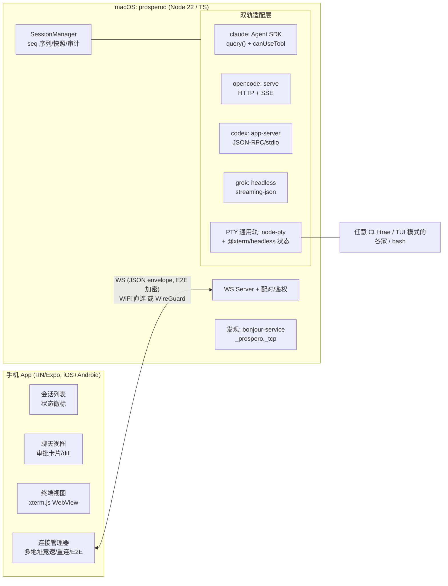

# Prospero 架构探索:手机丝滑远控 Mac 上的 Code Agent

> 状态:探索定稿 v1(2026-08-03)。基于 4 路并行调研(竞品 / agent 接口 / 移动端 / macOS 宿主端),关键事实均经官方文档或仓库核实,未确认处标「待验证」。

## 0. 一句话结论

**做一个 macOS 常驻 daemon(`prosperod`,Node/TS)+ React Native (Expo) 手机 App,LAN/WireGuard 直连 WebSocket,零云中转;控制层走"双轨":有 API 的 agent 走结构化事件流(聊天 UI + 一键审批),没有的走 PTY + 服务端终端状态(秒开终端镜像)。** 客户端大量借鉴 Happy(MIT,同栈同形态),宿主端精读 VibeTunnel(MIT,架构最同构)。

---

## 1. 需求与差异化

| 需求 | 设计承接 |
|---|---|
| **iOS 优先**,Android 随后 | RN/Expo 单代码库:iOS 先行打磨,Android 后续以低成本跟上 |
| 控制 opencode / Claude Code / Codex / Grok / Trae | 双轨控制层 + per-agent 适配器 |
| 局域网直连 | WS 直连 + mDNS 发现 + QR 配对 |
| 多网卡(WireGuard utun) | daemon bind `0.0.0.0`;客户端多地址并发竞速 |
| 丝滑 | 服务端终端状态秒开 attach、断线无感重连、审批一键化(见 §6) |

**为什么还要自己做**(2026-08 竞品格局):

- Anthropic 官方 **Remote Control**(2026-02 上线,`claude remote-control` / `--rc`,扫码接管)已很强,但:转录**明文存 Anthropic 服务器(非 E2E)**、无 LAN 模式、只支持 Claude。
- 字节 **TRAE SOLO** 官方手机 App 已落地,但闭源、走字节云、只支持 Trae。
- **Happy**(MIT,23.1k★)产品形态最接近(结构化聊天 + 审批 + 语音),但默认走云 relay。

→ Prospero 的差异化 = **LAN/WG 零云依赖 + 跨 agent 统一 + 端到端加密**,正是官方方案都不做的组合。

## 2. 总体架构



后期(M3)加一个 **SwiftUI 菜单栏壳**:负责 TCC 权限归属(本地网络弹窗、~/Documents 访问)、展示配对 QR、管理 daemon 生命周期 —— 这是 VibeTunnel 验证过的形态(LaunchAgent 直接拉 Node 会踩 TCC "operation not permitted" 的坑,见 §9)。

## 3. 核心决策:双轨控制层

**终端镜像(轨 2)保证 100% 覆盖,结构化协议(轨 1)决定体验上限。** 竞品调研的最大共识:Happy / Omnara / 官方 RC 全都把会话建模为结构化事件流,手机端才做得出原生审批和 diff 审查;纯终端镜像(VibeTunnel)在手机上只是"能用"。两轨并存,同一会话默认聊天视图、可切终端视图兜底。

### 各 agent 适配矩阵(2026-08 核实)

| Agent | 结构化通道 | 审批回传 | 会话恢复 | 备注 |
|---|---|---|---|---|
| **opencode** ✅已实现 | `opencode serve` HTTP + SSE(`/api/event`),OpenAPI 3.1 在 `/doc` | `POST /api/session/:id/permission/:reqId/reply` `{reply}` | 原生多会话 | **完整度最高**;实测坑见下方「实现记录」 |
| **Claude Code** ✅已实现 | `@anthropic-ai/claude-agent-sdk` 0.3.x 的 `query()`,流式输入(AsyncIterable) | SDK `canUseTool` 回调 —— 挂起 promise 等手机回复 | `interrupt()`;`--resume` 待接 | 官方推荐 SDK 而非解析 CLI;实测坑见下方「实现记录」 |
| **Codex CLI** | `codex app-server`:JSON-RPC 2.0 newline/stdio(实验性 `--listen ws://`),IDE 扩展同款;`codex app-server generate-ts` 可生成类型 | server→client 请求 `item/commandApproval` / `item/patchApproval`,客户端回执即裁决 | `thread/resume` / `thread/fork` | 另有 `codex exec --json`(无交互审批,靠 sandbox);app-server 标实验性,版本随 CLI 漂移 |
| **Grok Build**(xAI 官方 CLI,2026-05 beta) | `grok -p --output-format streaming-json`(`session/update` 分片,形似 ACP) | 仅 `--always-approve`(粗粒度,无逐条回调,待验证) | `-r/--resume <id>`、`-c` | 精细审批做不到 → 交互审批场景回落 PTY 轨 |
| **trae-agent**(开源) | 无流式 API;`trae-cli run --trajectory-file traj.json` 事后 JSON,可 tail 近似流式 | 无 | 无 | roadmap 已列 Programmatic API;当前=子进程 + trajectory tail |
| **Trae SOLO / 其他任意 CLI** | 无 | — | — | **纯 PTY 轨** |

### 实现记录:适配器踩到的真实差异(2026-08-04,M2 落地)

文档/spec 与实际行为不一致的地方,都是实跑才发现的:

**opencode 1.18.12**
- SSE 事件负载在 `data` 字段,而非 OpenAPI spec 里写的 `properties`
- 响应体统一包在 `{data: ...}` 里
- **服务端口先于模型 catalog 就绪(约 1.4s)**;在此窗口内发的 prompt 会被
  `admitted` 但**永不调度**——表现为"发了消息没反应"且无任何报错。适配器以
  `GET /api/model` 返回非空作为就绪信号
- 创建会话必须显式带 model(从 `GET /config` 的 `model` 字段读,格式
  `providerID/model-id`,id 本身可含斜杠)

**Claude Code 2.1 / Agent SDK 0.3.x**
- 审批不是事件而是 `canUseTool` 回调:必须挂起 promise 等手机回复。
  `always` 要回传 SDK 给的 `suggestions` 作为 `updatedPermissions`
- **安全命令分类器会自动放行只读/无害操作**(`echo`、cwd 内 Read),不走
  `canUseTool`——测试审批链路必须用写操作,否则会误判为"审批没触发"
- 工具调用只在完整 assistant 消息里出现;增量流(`stream_event`)只给文本与 thinking
- 输入必须用流式(AsyncIterable)才能支持 `interrupt()` 与多轮

**测试工程**:两个适配器的集成测试都会拉起真实 agent 子进程,并行跑会资源
抢占导致偶发超时 → daemon 测试串行执行(`vitest.config.ts`)。

### 远程 Shell 会话(内置的 SSH 平替)

PTY 轨对"任意 CLI"的支持里天然包含 **spawn `$SHELL`(zsh)**——即手机上直接开一个 Mac 的交互 shell,作为一种一等会话类型(`session.create{agent:"shell"}`):

- **免开 macOS 的"远程登录"(sshd)**,不多暴露一个端口;复用 Prospero 全套机制:QR 配对、E2E 加密、快照秒开、断线重连、多地址竞速。
- **体验优于真 SSH**:SSH 在 WiFi↔WG 切换/切后台时连接即断且无状态恢复;Prospero 重连自带画面快照与 seq 续传(mosh 才有的韧性,但不需要装 mosh)。
- 在 shell 里 `ssh user@host` 到其他机器,**Mac 即成跳板机**,App 端零改动就能管到全内网。
- 安全:shell = 完整用户权限,比单个 agent 会话权力更大 → 配对时按设备粒度提供 `allowShell` 能力开关(默认开给自己的主力手机,审计日志全记录)。

### PTY 轨的工程要点(调研核实的坑)

- 服务端每会话挂一个 **`@xterm/headless` 6.0** 实例吃 PTY 输出,attach 时用 **`@xterm/addon-serialize` 0.14** 输出含颜色/光标/scrollback 的 ANSI 串一次下发 → 手机端**打开即完整画面**,之后走增量流。这是"秒开"的核心机制,VibeTunnel 同款思路。
- 必须设 `TERM=xterm-256color`、正确转发 resize(TIOCSWINSZ),并**应答终端查询**:Claude Code(Ink)启动会发 DSR `ESC[6n`,wrapper 不回 `ESC[row;colR` 会挂起/串码;Codex TUI(ratatui)走 alternate screen + 鼠标捕获 + bracketed paste。>1KB 粘贴经 PTY 有死锁报告,输入侧要分片。
- `node-pty` **1.1.0**(2025-12,微软维护)已内置 darwin-arm64 prebuilds,免编译;**Bun 下 node-pty 不可用**(Bun 1.3.5 有原生 `Bun.Terminal` 可作备选)→ **运行时选 Node 22,不选 Bun**。

## 4. 连接、发现与多网卡(WireGuard)

- daemon bind `0.0.0.0:<port>`,用 `os.networkInterfaces()` 枚举 en0 / utun* 的全部地址生成**候选地址列表**。
- **发现三层**(关键事实:**mDNS 组播不过 WireGuard 隧道**,已核实):
  1. **mDNS/Bonjour**(`_prospero._tcp`,`bonjour-service` 1.4.4)— 只对同一 WiFi 广播域有效;
  2. **QR 配对** — 载荷 `{v, name, addrs[](en0+utun 全量), port, deviceToken, pubKey}`,一次扫码把所有网卡地址 + 信任凭证带走;
  3. **地址簿记忆** — 客户端持久化每台 Mac 的历史可达地址。
- 连接时对候选地址**并发竞速**(happy-eyeballs 式,先握手成功者胜),WiFi ↔ WG 切换无感。整套模型是"配对码 → token → 直连,且地址可变"。

### 安全模型

- **应用层 E2E(NaCl/libsodium):QR 交换密钥,ws 之上全消息加密。** 不用自签证书 WSS —— RN 对自签 WSS 支持差(调研提示,需绕),而 Happy 的 TweetNaCl E2E 层是 MIT 现成实现,与任意传输兼容(WG 内双重加密无妨,LAN 上则是唯一保护)。
- 每客户端独立 token,可撤销;daemon 端审计日志。Token 存储:`@napi-rs/keyring`(keytar 已死)或 0600 文件(MVP 够用)。

## 5. 统一会话协议(Prospero Protocol v0)

WS + JSON envelope(E2E 加密后传输),所有 S→C 事件带单调 `seq`,attach 带 `lastSeq` 续传:

```
C→S  hello{token}  session.create{agent: claude|opencode|codex|grok|trae|shell|custom, cwd, mode}
     session.attach{id, lastSeq}
     prompt.send{id, text}            // 结构化轨
     term.input{id, dataB64}  term.resize{id, cols, rows}   // PTY 轨
     permission.respond{id, reqId, allow, always}  session.interrupt{id}  session.kill{id}

S→C  hello.ok{sessions[], hostInfo}
     session.state{id, status: running|waiting_approval|idle|done|died}
     term.snapshot{id, ansiSerialized, seq}  term.output{id, dataB64, seq}
     msg.delta{id, role, text}  tool.start{id, tool, args}  tool.end{id, result}
     diff.file{id, path, patch}  permission.request{id, reqId, tool, args, diff?}
     turn.end{id, usage, cost}
```

结构化轨事件是对 claude(stream-json)/ opencode(SSE 80+ 事件)/ codex(app-server 通知)的**归一化**——命名基本对齐 codex app-server 的 thread/turn/item 模型,它是三者中最干净的。

## 6. "丝滑"的工程化定义(逐条可验收)

1. **秒开 attach**:serialize 快照而非重放日志,目标 <100ms 上屏。
2. **断线无感**:指数退避 + 多地址并发竞速;重连 = 快照 + `lastSeq` 续传;iOS 切后台 socket 数秒即断(系统行为,已核实)→ 回前台走同一条恢复路径,目标 <100ms。
3. **审批零摩擦**:`permission.request` → 卡片一键 Allow / Deny / Always;官方 RC 的数据表明**审批是最高频的远程操作**,这是核心交互,置顶设计。
4. **输出不卡**:PTY 输出按帧合并(30–60fps flush;VibeTunnel 用 50ms 聚合),WebView 端虚拟滚动。
5. **键盘工具条**:Esc / Tab / Ctrl-C / ↑↓ / slash 命令与常用 prompt 快捷条。
6. **多会话总览**:实时徽标,waiting_approval 置顶 + 本地通知(App 在前台/后台未挂起时)。

## 7. 移动端选型:RN/Expo,**iOS 优先**(定论)

调研评分:RN/Expo 21.5 > Flutter 20 > 双原生 15.5。决定性理由:**Happy(MIT)用完全相同的栈把同形态产品跑通了**(Expo Router / expo-camera QR / expo-notifications / E2E 层 / EAS 构建),会话协议、审批 UI、加密实现都可直接借鉴;而 Prospero 的主视图是结构化聊天,不是终端。

**iOS 优先的落地含义**(2026-08 决定):M1/M2 只做 iOS(真机 + iPad 顺带支持),Android 在 M3 以同一代码库跟上(差异主要是前台服务、ntfy 通道、返回键/权限适配)。选 RN/Expo 的结论不变——iOS 优先是排期,不是换栈的理由。

- 终端视图:xterm.js in `react-native-webview`(有 `@fressh/react-native-xtermjs-webview` 现成封装)。**iOS 优先显著降低了这条路的风险**:WKWebView 支持 WebGL renderer,iPhone 的 A 系 GPU 远强于低端 Android,原调研中"低端 Android WebView 卡顿"的主要担忧移出了关键路径。若实测仍不满意,iOS 专属升级路径是把 **SwiftTerm(MIT,La Terminal 生产验证)** 封装成 Expo native module——比 Flutter 重写便宜得多。**不碰 Termux TerminalView(GPLv3 传染)、不引入 claudecodeui 代码(AGPL)。**
- mDNS:`react-native-zeroconf`(2025-12 仍活跃);QR:expo-camera。
- **iOS 本地网络权限**(随 iOS 优先提入 M1 第一周):Info.plist 必须同时含 `NSLocalNetworkUsageDescription` + `NSBonjourServices`(精确列 `_prospero._tcp`);弹窗只在首次实际发 LAN 流量时出现 → 做引导页主动预触发;被拒后 mDNS **静默超时不报错**,要做显式检测与引导;模拟器常不弹窗,真机调试。
- 分发(个人用):iOS 建议直接上 $99 开发者账号走 TestFlight(免费账号 7 天重签 + 3 App 限制,日常自用太折磨);Android 后续直接装 APK。

## 8. 通知:iOS 的硬约束与务实解

**结论先行:iOS 纯 LAN + App 被挂起 = 无解**(APNs 要走苹果云;Local Push Connectivity entitlement 面向邮轮/酒店场景,个人申请不现实)。务实分层:

| 场景 | 方案 |
|---|---|
| App 前台 | WS 直推,应用内横幅 |
| Android 后台 | 自建 **ntfy** + F-Droid 版前台服务:**纯 LAN 即时送达、零 Google 依赖**(已核实) |
| iOS 后台,Mac 能出公网 | 自建 **bark-server**(内嵌 Bark 官方 APNs key,支持端到端加密)推"会话 X 待审批"摘要,点击回 App 走 LAN 连接 |
| iOS 后台,纯内网 | 接受失联;靠 Apple Watch/回前台;文档明示 |

daemon 只推**元数据摘要**(会话名 + 状态),内容不出内网,与零云依赖原则一致。

iOS 优先带来的两个具体调整:**Bark 通道从 M3 提前到 M2**(它是 iOS 后台唤起的唯一务实通道);且注意 **Prospero App 自身不需要 push entitlement**——推送由 Bark App 接收,点击深链回 Prospero 再走 LAN 连接,免费开发者账号也不受影响。Android 的 ntfy 通道随 Android 端顺延至 M3。

## 9. macOS 宿主端要点

- **技术栈**:Node 22 + TS;`node-pty` 1.1.0;`@xterm/headless` 6.0 + `@xterm/addon-serialize` 0.14;`ws`;`bonjour-service` 1.4.4;`@napi-rs/keyring`。
- **TCC 两个坑**(均已核实,决定 M3 要做 Swift 壳):
  1. LaunchAgent 直接拉起的 node 访问 `~/Documents` 会 "operation not permitted",且 LaunchAgent 无法在设置里授权 → VibeTunnel 的解法:**菜单栏 .app 作为父进程 spawn daemon**,TCC 归属 app bundle,弹窗/授权正常;
  2. macOS 15+ 本地网络也有 TCC 弹窗,由 Swift 壳承担 Bonjour 广播比裸 Node 干净。
  - **MVP 过渡**:直接在终端里跑 `prosperod`(继承终端的权限),不装 LaunchAgent,绕开两坑。
- **会话韧性**:daemon 直接子进程 → daemon 挂 = 会话挂(PTY 关闭收 SIGHUP;reptyr 不支持 macOS)。M1 接受此限制(headless 状态定期 serialize 落盘,重启后画面可恢复、进程已死);M3 可选 **tmux-as-supervisor**(agent 起在 tmux 里,daemon 只是 client,重启 re-attach 无损)——这是事实标准,VibeTunnel 也这么做。
- 签名:个人使用 ad-hoc `codesign -s -` 即可。

## 10. 分期路线

| 阶段 | 内容 | 产出 |
|---|---|---|
| **M0**(半天,可选) | tmux + Termius/Blink(或 VibeTunnel + WG)体验基线 | 痛点清单,校准"丝滑"标准 |
| **M1 MVP**(1–2 周) | `prosperod`:PTY 通用轨(含 shell 会话)+ headless 快照 + WS 协议 + QR 配对 + mDNS;**RN App 仅 iOS 真机**:配对/本地网络权限引导/会话列表/终端视图/键盘工具条;多地址竞速重连;第一周做 WKWebView 终端性能 spike | **iPhone 已可控全部 5 家 agent + 远程 shell**(终端形态) |
| **M2**(每适配 1–3 天) | 结构化轨:**opencode(最易)→ Claude SDK → Codex app-server → Grok headless**;聊天 UI + 审批卡片 + diff 查看;**Bark 审批推送(iOS)** | 主力 agent 达到"丝滑"上限 |
| **M3** | **Android 端跟进(同代码库 + ntfy 前台服务)**、SwiftUI 菜单栏壳(TCC/Bonjour/QR/开机自启)、tmux supervisor、语音输入、多 Mac、git/文件面板 | 产品化 |

## 11. 风险与开放问题

1. **Codex app-server 是实验性协议**,随 CLI 版本漂移 → 用 `generate-ts` 锁 schema,适配层做版本检测。
2. **Grok 精细审批做不到**(仅 `--always-approve`)→ 交互审批场景回落 PTY 轨;跟踪其 ACP 化进展。
3. **RN WebView 终端性能** → iOS 优先后风险大减(WKWebView WebGL + A 系 GPU),M1 第一周 spike 验证;iOS 兜底路径是 SwiftTerm 封装成 Expo native module;低端 Android 的问题随 Android 端顺延到 M3 再实测。
4. **RN 自签 WSS 兼容性差** → 已用"应用层 E2E over ws"绕开,需 M1 早期 spike 验证 libsodium 在 RN 的性能。
5. **iOS 纯内网后台失联**是平台约束,不是工程问题 → 明示用户,靠 Bark(需 Mac 公网出口)缓解。
6. trae-agent 的 Programmatic API 在官方 roadmap 上 → 落地后把 trajectory-tail 适配升级为真流式。
7. Anthropic RC / TRAE SOLO 免费官方方案会持续吞噬"纯转发"价值 → 坚持差异化组合(零云 + E2E + 跨 agent),不做单 agent 的官方复刻。

## 12. 参考(精读顺序)

1. **VibeTunnel**(MIT)— 架构最同构:Swift 菜单栏 + Node PTY server + 二进制帧聚合 · github.com/amantus-ai/vibetunnel
2. **Happy**(MIT)— Expo 客户端 + E2E 层 + QR 配对,可 fork 起步 · github.com/slopus/happy
3. **opencode server 文档** · opencode.ai/docs/server
4. **Codex app-server** · github.com/openai/codex/tree/main/codex-rs/app-server
5. **Claude Agent SDK** · code.claude.com/docs/en/agent-sdk/typescript;官方 Remote Control(对照) · code.claude.com/docs/en/remote-control
6. **sshx**(协议设计干净)· github.com/ekzhang/sshx;**ttyd**(最精炼 PTY+WS)· github.com/tsl0922/ttyd
