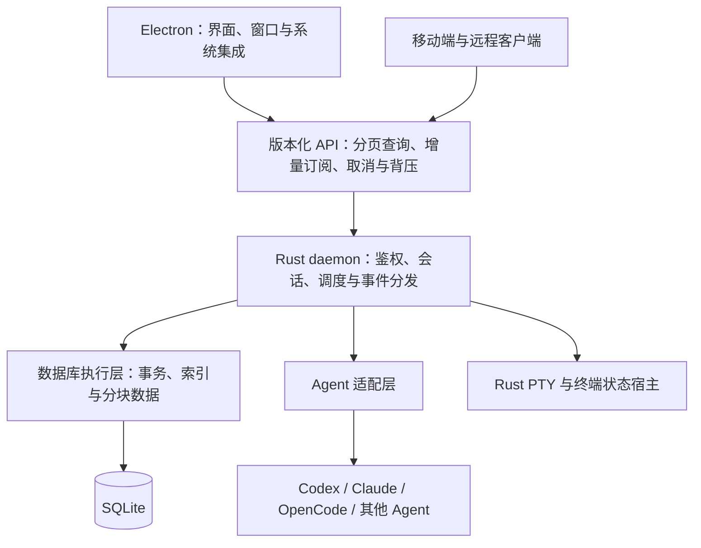

# Prospero Rust daemon 性能重构计划

状态：已授权实施，正在独立 worktree 的 `exp/rust-re` 分支推进；各改造项验收后提交并推送。

## 1. 目标与执行方式

保留 Electron 桌面界面，以 Rust 重构 daemon、会话运行时、编排调度、Claude 适配和 PTY 终端状态管理。目标是降低启动耗时、常驻内存和交互延迟，消除全量加载、重复扫描及无界资源增长。

获得实施授权后，持续完成本文全部阶段。阶段是内部组织与验收单位，通过后自动进入下一阶段，不逐阶段请求确认，也不以原型、骨架或单一 Agent 可用作为最终交付。

仅在缺少必要凭据或平台环境、需要改变约定范围、需要额外的高影响操作授权，或存在无法自行解决的外部阻碍时暂停依赖该条件的工作；其他独立工作继续推进。

本次实施授权包含重构、逐项提交和推送，不扩展日常安装或远端部署范围。

## 2. 范围

### 纳入范围

- Rust daemon：存储、查询、调度、会话生命周期、事件分发、网络、鉴权和进程管理。
- Electron：保留现有前端与系统集成，修改主进程启动方式和前后端接口。
- Electron 外壳的样式、布局和交互以远程最新主线为基准，复用现有侧边栏、工作区、标签栏、主题和设计系统。Rust 重构只调整数据接口及必要的性能实现，不另建一套外壳或独立视觉风格。每次外壳接入前核对主线更新，并进行视觉回归。
- SQLite：由 daemon 独占管理，前端不得直接访问数据库文件。
- Claude：适配器、消息队列、流式处理、工具与审批、中断、继续和资源释放。
- PTY：终端进程、终端状态、滚屏、快照、重连、窗口尺寸和跨平台进程树管理。
- Codex、OpenCode 及其余现有 Agent：逐项保留现有产品功能。
- DAG、协作消息、远程连接、配对、加密、官方登录和第三方模型源。
- 移动端：同步调整受新协议影响的功能并验证端到端链路。
- macOS、Linux 和 Windows 的 daemon；现有受支持桌面、移动端平台的必要接入。
- 性能测试、长时间运行测试、故障恢复测试、安全审计和 Release 打包。

### 边界

- 不要求兼容旧 daemon 协议、旧数据库格式或旧会话持久化格式。
- 不要求迁移现有生产历史数据；如后续需要，单独定义迁移与回退范围。
- 不得以取消历史兼容为由删除现有产品功能。
- 不针对某台机器、某个业务名称、某个模型供应商或某份数据集编写特殊逻辑。
- 不重写 Electron 渲染引擎，也不以更换桌面框架作为本次性能优化手段。
- Rust 重构本身不承诺消除外部 Agent CLI、模型服务和 Electron 的资源开销。

## 3. 分支与隔离

实施分支：`exp/rust-re`。基线：`2e2d94479a8496d273ace12dfaf092003cd6a7d7`。

开始前核对工作区，保留现有未提交的 SQLite 改造等工作。不得直接清空、覆盖或顺带提交这些改动。根据实际状态使用独立 worktree，并记录重构基线。

- 开发实例使用独立端口、私有数据目录和测试凭据。
- 测试只使用合成或已获授权且脱敏的数据。
- 日常安装、本机原数据目录和远端使用者环境保持隔离。
- 文档、代码、测试和提交信息只使用通用名称与示例。
- 提交、推送、日常安装替换和远端部署按对应的明确授权执行；不将其他任务的操作范围自动扩展到本重构。

## 4. 目标架构

数据库执行层承接阻塞操作，不占用网络事件循环。写事务统一协调；连接池、后台任务、并发请求和队列均有上限。

独立会话宿主的数量由活跃工作决定，不由历史会话数量决定。需要 daemon 重启后继续存活的 Agent 或终端，由生命周期独立的宿主管理；归档记录不保留宿主进程。

## 5. 不可放宽的设计约束

1. 历史会话仅保存为记录，启动时不逐条实例化运行时对象。
2. 单条状态更新显式指定变更记录，不扫描完整状态计算差异。
3. 元数据与大正文、工具输出、附件和终端历史分离；大数据分块落盘和读取。
4. 列表分页，详情按需读取，图按运行及邻域查询；前端只保留有限页面和缓存。
5. 更新事件按运行或会话分发，不为每个客户端生成完整全局快照。
6. 消息等待由统一注册表管理，完成、超时、取消和断线都有清理路径。
7. 队列、滚屏、缓存、订阅缓冲及后台并发均有明确容量限制和超限行为。
8. 慢消费者通过背压、合并可合并状态或游标重同步处理，不静默丢弃必须交付的事件。
9. 事务与事件游标保持一致；恢复时不得丢失已提交数据或重复派发任务。
10. 历史恢复期间合并可合并的对账工作，恢复完成后统一核对；正常运行中的事件及时处理。
11. 官方账号登录与第三方模型源分开验证，不通过削弱鉴权、权限或 TLS 校验解决兼容问题。

## 6. 完整实施阶段

| 阶段 | 工作内容 | 交付与退出条件 |
| --- | --- | --- |
| 1. 基线与数据集 | 建分支、盘点功能和接口；测量启动、内存、查询、事件与终端性能；构造通用负载 | 可重复运行的基线、功能覆盖矩阵、固定测试环境和性能阈值 |
| 2. 架构与协议 | 明确模块所有权；定义分页、过滤、排序、游标、增量事件、取消、超时、错误和背压语义 | Rust 与 TypeScript 共用的契约来源、生成方式和协议测试 |
| 3. 存储与查询 | 实现 SQLite 结构、索引、事务、分块内容、局部更新与数据库执行层 | 不全量加载历史；单条修改不全库扫描；恢复与一致性测试通过 |
| 4. 会话与事件 | 活跃会话注册、按需加载、进程所有权、统一消息等待、队列及订阅管理 | 正确处理取消与资源回收；事件续传、慢客户端和断线恢复通过 |
| 5. Agent 适配 | 重构全部现有 Agent 的实际执行链路；验证 Claude 实现方式 | 真实对话、工具调用、审批、中断、继续、退出及失败恢复逐项通过 |
| 6. PTY 与终端 | 实现终端宿主、状态解析、滚屏、快照、resize、重连和进程树管理 | macOS/Linux PTY 与 Windows ConPTY 通过终端一致性和长时间输出测试 |
| 7. DAG 与协作 | 实现依赖索引、就绪队列、局部传播、幂等派发、协作等待及批量恢复对账 | 大 DAG 无逐事件全量扫描；不重复派发、不遗漏有效状态变化 |
| 8. Electron 接入 | 启动 Rust 二进制；移除数据库读取；页面改用分页与增量 API；虚拟列表与有限缓存 | 全部现有桌面功能可用，日常操作不依赖旧 daemon |
| 9. 远程与安全 | 完成配对、鉴权、加密、权限、流式转发和断线恢复；同步移动端接口 | 桌面、移动端与远程链路通过端到端及安全测试 |
| 10. 压测与交付 | 完成大数据、长时间负载和故障注入；持续修复未达标部分；审计并打包 | 性能门槛、功能矩阵和审计全部通过，输出完整 Release 产物 |

阶段并非严格串行：Claude、PTY 和 Windows 技术验证提前开展；前端接入从接口稳定后持续进行；性能测试贯穿全过程。任何阶段的发现需要调整前序实现时，返回修复后再继续，不保留已知阻塞问题到最终交付。

首个纵向里程碑为：Electron 分页列表 → Rust API → SQLite → 一个真实 Agent 和一个 PTY → 增量显示 → 中断与关闭 → 资源释放验证。它用于尽早检验架构，不是任务完成点。

## 7. Claude 与 PTY 专项要求

### Claude

必须改造会话驻留、SDK 实例生命周期、消息队列、流式事件转换、工具和审批、中断、超时及资源回收。

优先验证 Rust 直接适配的可维护接口。如果直接适配无法满足官方登录、工具语义或升级稳定性要求，可保留按需运行的独立 SDK 桥接进程，但会话管理、持久化、队列和调度必须归 Rust。对两种方案使用相同负载比较内存、首响应延迟、取消延迟及稳定性，记录选择依据，不能仅凭语言偏好决定。

不要求替换 Claude 自身的官方运行程序；不通过维护脆弱的内部协议来换取未经证实的性能收益。

### PTY 与终端状态

Rust 负责终端进程和服务端状态，Electron xterm 负责展示。终端字节流与结构化聊天事件使用不同的数据通路和缓冲策略。

必须覆盖：全屏 TUI、备用屏幕、光标控制、颜色、中文与 emoji、换行和滚屏、复制、连续 resize、断线重连、快照加增量衔接、退出状态以及进程树清理。容量达到上限时要明确区分可裁剪的历史滚屏与必须保留的当前屏幕状态。

## 8. 性能与正确性验收

阶段 1 在固定机器和负载下设定绝对延迟、内存及吞吐阈值。记录硬件、操作系统、构建模式、负载和测试次数，比较 p50、p95 与峰值，不能只报告平均值或最好的一次。后续不能为通过验收而静默降低阈值。

| 场景 | 验收要求 |
| --- | --- |
| 1 万、10 万条归档会话 | 不逐条恢复运行对象；常驻内存不随历史正文总量线性增长 |
| 相同活跃会话数、不同历史规模 | 查询服务可尽早就绪；活跃恢复与历史浏览解耦 |
| 单任务状态变化 | 不扫描全库、不生成完整状态快照，只更新相关记录与依赖 |
| 大 DAG | 查询和传输受指定范围约束，前端不加载全部运行的图 |
| 大工具输出与附件 | 分块写入、按需读取，网络与内存缓冲有上限 |
| 慢速或断续连接 | 有界积压，取消有效，能从游标继续或明确重同步 |
| 长时间终端输出 | 滚屏和缓存有界，当前屏幕及重连状态正确 |
| 反复创建、关闭和重连 | 进程、连接、订阅与句柄数量回落，不持续增长 |
| 异常退出与存储故障 | 已提交数据不丢失，不重复派发，错误可观察且不会无限重试 |
| 官方登录与第三方源 | 分别验证凭据隔离、请求路由、工具行为和兼容策略 |

SQLite 持久化正确不等于整个运行时性能达标；Rust 编译成功、能聊天、单次压测通过也都不能代替上述验收。

## 9. 风险与处理

- Agent CLI 和 SDK 变化：适配器独立封装，以契约测试和真实 CLI 验证控制升级风险。
- 终端解析差异：使用固定终端事件轨迹、参考画面和重连测试比较，不只检查输出字符串。
- Windows 进程与权限语义：提前验证 ConPTY、进程树、权限及宿主存活行为，在真实平台验收。
- SQLite 写入竞争：短事务、明确写入调度、索引查询、可观察的等待与超时，阻塞操作不进入网络线程。
- 全量加载在新实现中复现：代码审查和大数据测试显式检查数据规模与资源增长关系。
- 双运行时过渡：同一数据目录不得由新旧 daemon 同时写入；桥接进程不成为第二套状态真相。
- 环境不足：平台或凭据缺失时明确标记对应项目未验收，继续其他工作，不将跳过测试表述为通过。

## 10. 最终交付与完成条件

- 新本地分支上的 Rust daemon、Electron 接入及必要的移动端修改。
- 全部现有产品功能的覆盖矩阵，包含已验证平台和实际 Agent 版本。
- 通用合成数据集、性能测试、故障恢复测试及可复现执行入口。
- 新旧实现同负载对比和所有性能阈值的验收结果。
- 可安装 Release 包、构建信息和校验和。
- 代码与敏感信息审计结果、已知限制和操作说明。
- 在明确授权范围内完成安装或部署；默认不替换其他使用者环境。

完成意味着全部约定阶段和验收项已交付。若仍有功能、平台或外部环境阻碍，最终报告必须逐项说明，不能将部分完成标记为整个重构完成。

实施期间持续汇报进展、测量结果、风险和范围变化，不逐阶段停下来询问是否继续。整体按数月量级评估，阶段 1 结束后依据基线和技术验证结果收敛工期，不以未经验证的日期作为交付承诺。

## 11. 实施记录

- 已创建独立 worktree，分支为 `exp/rust-re`；原工作区未提交的 SQLite 改造保持原样。
- 性能入口：构建旧 daemon 后运行 `node tools/perf/legacy-baseline.mjs --output <report.json>`。脚本自动生成和清理隔离数据，每轮复制全新数据；不强制清空操作系统磁盘缓存，不启动真实 Agent 进程。
- 已记录 macOS arm64 下 1 万、10 万条归档会话与任务的三轮数据，以及 xterm 解析和快照数据：`tools/perf/legacy-baseline-macos-arm64.json`。
- 基线测量的是旧版会话恢复、列表查询、编排存储及 headless 终端子系统，不代表整个 Electron 应用的启动或渲染指标。事件吞吐、慢网络、活跃 Agent 和跨平台数据仍需补齐。
- 功能覆盖清单：`tools/perf/coverage.json`；初始性能目标：`tools/perf/acceptance.json`。其中待完成项目必须通过实际运行验证后才能改变状态。
- 首批 Rust 核心位于 `apps/daemon-rs`：会话元数据索引分页、正文分块、事务内变更事件、单写入方锁及容量为 128 的数据库工作队列。数据库操作使用独立线程，已取消的排队操作不再执行，队列满时明确返回 busy。
- Rust 类型生成 `packages/protocol/src/rust-daemon.ts`；运行 `npm run rust:contract:check` 校验双端契约一致。Rust 检查入口为 `npm run rust:check`、`npm run rust:test`。
- 存储实测入口为 `npm run perf:rust-storage`，记录在 `tools/perf/rust-storage-macos-arm64.json`。这是存储初始化与分页子系统的结果，不是完整 daemon、HTTP 或 Electron 性能结果。
- HTTP 分页、元数据改名、正文分块和增量事件回放/SSE 已接入；真实进程冒烟测试覆盖鉴权、跨源拒绝、翻页、提交后回放、实时事件和正常关闭。
- 运行时会话、Agent、PTY、DAG、既有 Electron 外壳接入与跨平台验收尚未完成；不得将首批核心完成视为整个重构完成。
- 已按用户要求撤掉未提交的独立 Rust 预览界面；当前外壳基准为 `origin/master` 的 `2e2d944`，后续通过数据适配接入原有页面。独立预览不作为外壳交付。
- 已补齐会话总数及待处理摘要、项目分页、项目/生命周期筛选、索引搜索和最多 100 个 ID 的批量查询。计数、全文索引、记录修改与事件在同一事务内提交；列表返回事件水位，翻页游标绑定筛选条件。搜索按 Unicode 词项前缀匹配，多词取交集，不接受搜索表达式或正文搜索。
- 搜索 SQL 设置 250 毫秒执行预算，超时中断查询并保留数据库连接可用性。宽泛搜索根据命中数量选择有序索引，全部命中时省去重复筛选；分页只反序列化当前页。实验数据库结构版本为 2，不自动转换旧实验数据库。
- 查询压测记录在 `tools/perf/rust-query-macos-arm64.json`：十万条合成归档的三轮宽泛搜索 p95 为 3.8–4.6 毫秒，排除少量记录后的搜索 p95 为 14.5–27.8 毫秒。范围仍限元数据 HTTP 服务，不包含实际 Agent、PTY、Electron 渲染或所有数据分布的性能验收。
- 查询改造验证：28 个 Rust 测试、真实 HTTP 冒烟、Rust/TypeScript 契约、lint/typecheck 和 380 个桌面测试通过。桌面全量测试使用 `TMPDIR=/private/tmp` 避免 macOS `/var` 与 `/private/var` 别名导致的既有路径断言差异；未修改外壳样式或放宽测试断言。
- 原 Electron 主进程已增加 Rust 实验模式，仍使用同一个窗口、preload、侧栏、工作台与标签页；样式文件未修改。`npm run dev:desktop:rust` 启动该模式，`PROSPERO_RUST_HOME` 可指定独立根目录，默认使用单独的应用数据目录；daemon、Electron 配置和桌面偏好分别隔离。
- Rust 模式下，StateStore 从内存中的 API 数据生成桌面状态，不读取旧 daemon 的状态、配置、设备或编排投影文件，也不启动 legacy projection worker。会话名称通过 Rust 事务修改，Electron 只保存桌面偏好；会话种类由 Rust 明确提供，不从 Agent 名称推断。实验数据库结构版本为 3。
- 桌面初始窗口最多包含 100 条 active 与 20 条 archived 记录；项目目录先取 100 条，完整历史通过分页和搜索访问。空闲时以 500 毫秒间隔查询事件游标，没有变更不刷新数据页、不广播相同快照；有变更或事件保留窗口失效时刷新有界页面并使打开会话与搜索缓存失效。尚需补齐项目目录后续分页、attention 优先窗口及更细的按对象订阅。
- `npm run rust:desktop:test` 在临时目录验证真实 Rust 进程：并发启动复用一个进程、一万条归档仅加载 20 条摘要、历史/置顶分页、外部提交同步、改名持久化、重启、第二写入方拒绝、异常退出和启动取消后的重新启动。它与无网络桌面单元测试分开运行。
- 已通过本机 Electron 实际界面检查：原侧栏可以搜索初始窗口之外的历史会话，并使用原标签页和工作台打开。Agent 执行、正文视图、PTY、账号、DAG 和远程控制仍未接入 Rust，此时会明确报未接入；这不是可替换日常安装的完整版本，跨平台及完整视觉回归仍待完成。
- 本轮检查通过：28 个 Rust 测试、383 个桌面单元测试（全量回归及新增用例单独复核）、3 个真实进程集成测试、lint/typecheck、生成契约校验和 Electron 构建。按工作区展开更多历史会话仍需改成 API 分页，目前只展示已取回的窗口；实验预览使用合成数据且已关闭清理。
- 工作区内的历史分页已接入原侧栏：预览 6 条、展开后每页 24 条，支持上一页、下一页、回到第一页和收起。数据库提供双向 keyset 游标，前端不保存已浏览的历史页；翻页过程不扩充桌面全局会话摘要。工作区计数来自事务内维护的真实总数。
- 每个工作区的 revision 与会话变更在同一事务中维护，用于只刷新相关工作区，并在刷新时保留当前位置。收起、切换和卸载会取消请求；前端并发限制为 4、等待队列最多 128，主进程请求注册表最多 32 条，带取消和超时回收。实验数据库结构版本为 4。
- 本轮新增双向游标、同时间戳、筛选变更、工作区版本隔离、连续翻页缓存上限、迟到响应、取消及过载测试。31 个 Rust 测试、389 个桌面测试（全量回归及变更后相关用例复核）、4 个真实进程集成测试、HTTP 冒烟、lint/typecheck、生成契约及构建通过。
- `tools/perf/rust-workspace-pages-macos-arm64.json` 记录十万条归档下三轮前后翻页 p95 为 0.4–1.0 毫秒；测量范围为元数据 HTTP 服务。实际 Electron 已验证一万条计数、显示更多、前后翻页，以及第二页接收名称变更后保持当前位置；复用原有外壳和按钮样式。工作区目录超过首批 100 条的分页、正文、运行时及其他未验收项继续推进。
