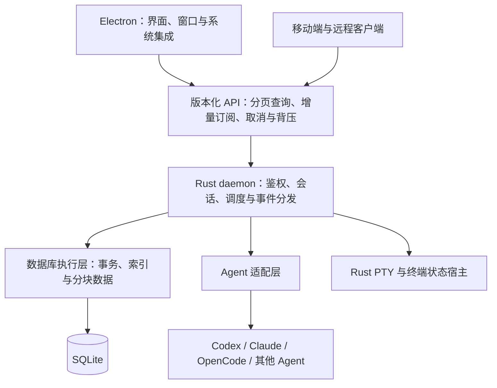

# Prospero Rust daemon 性能重构计划

状态：已授权实施，正在独立 worktree 的 `exp/rust-re` 分支推进；各改造项验收后提交并推送。

## 1. 目标与执行方式

保留 Electron 桌面界面，以 Rust 重构 daemon、会话运行时、编排调度、Claude 适配和 PTY 终端状态管理。目标是降低启动耗时、常驻内存和交互延迟，消除全量加载、重复扫描及无界资源增长。

获得实施授权后，持续完成本文全部阶段。阶段是内部组织与验收单位，通过后自动进入下一阶段，不逐阶段请求确认，也不以原型、骨架或单一 Agent 可用作为最终交付。

仅在缺少必要凭据或平台环境、需要改变约定范围、需要额外的高影响操作授权，或存在无法自行解决的外部阻碍时暂停依赖该条件的工作；其他独立工作继续推进。

本次实施授权包含重构、逐项提交和推送，不扩展日常安装或远端部署范围。

## 2. 范围

### 纳入范围

- Rust daemon：存储、查询、调度、会话生命周期、事件分发、网络、鉴权和进程管理。
- Electron：保留现有前端与系统集成，修改主进程启动方式和前后端接口。
- Electron 外壳的样式、布局和交互以远程最新主线为基准，复用现有侧边栏、工作区、标签栏、主题和设计系统。Rust 重构只调整数据接口及必要的性能实现，不另建一套外壳或独立视觉风格。每次外壳接入前核对主线更新，并进行视觉回归。
- SQLite：由 daemon 独占管理，前端不得直接访问数据库文件。
- Claude：适配器、消息队列、流式处理、工具与审批、中断、继续和资源释放。
- PTY：终端进程、终端状态、滚屏、快照、重连、窗口尺寸和跨平台进程树管理。
- Codex、OpenCode 及其余现有 Agent：逐项保留现有产品功能。
- DAG、协作消息、远程连接、配对、加密、官方登录和第三方模型源。
- 移动端：同步调整受新协议影响的功能并验证端到端链路。
- macOS、Linux 和 Windows 的 daemon；现有受支持桌面、移动端平台的必要接入。
- 性能测试、长时间运行测试、故障恢复测试、安全审计和 Release 打包。

### 边界

- 不要求兼容旧 daemon 协议、旧数据库格式或旧会话持久化格式。
- 不要求迁移现有生产历史数据；如后续需要，单独定义迁移与回退范围。
- 不得以取消历史兼容为由删除现有产品功能。
- 不针对某台机器、某个业务名称、某个模型供应商或某份数据集编写特殊逻辑。
- 不重写 Electron 渲染引擎，也不以更换桌面框架作为本次性能优化手段。
- Rust 重构本身不承诺消除外部 Agent CLI、模型服务和 Electron 的资源开销。

## 3. 分支与隔离

实施分支：`exp/rust-re`。基线：`2e2d94479a8496d273ace12dfaf092003cd6a7d7`。

开始前核对工作区，保留现有未提交的 SQLite 改造等工作。不得直接清空、覆盖或顺带提交这些改动。根据实际状态使用独立 worktree，并记录重构基线。

- 开发实例使用独立端口、私有数据目录和测试凭据。
- 测试只使用合成或已获授权且脱敏的数据。
- 日常安装、本机原数据目录和远端使用者环境保持隔离。
- 文档、代码、测试和提交信息只使用通用名称与示例。
- 提交、推送、日常安装替换和远端部署按对应的明确授权执行；不将其他任务的操作范围自动扩展到本重构。

## 4. 目标架构

数据库执行层承接阻塞操作，不占用网络事件循环。写事务统一协调；连接池、后台任务、并发请求和队列均有上限。

独立会话宿主的数量由活跃工作决定，不由历史会话数量决定。需要 daemon 重启后继续存活的 Agent 或终端，由生命周期独立的宿主管理；归档记录不保留宿主进程。

## 5. 不可放宽的设计约束

1. 历史会话仅保存为记录，启动时不逐条实例化运行时对象。
2. 单条状态更新显式指定变更记录，不扫描完整状态计算差异。
3. 元数据与大正文、工具输出、附件和终端历史分离；大数据分块落盘和读取。
4. 列表分页，详情按需读取，图按运行及邻域查询；前端只保留有限页面和缓存。
5. 更新事件按运行或会话分发，不为每个客户端生成完整全局快照。
6. 消息等待由统一注册表管理，完成、超时、取消和断线都有清理路径。
7. 队列、滚屏、缓存、订阅缓冲及后台并发均有明确容量限制和超限行为。
8. 慢消费者通过背压、合并可合并状态或游标重同步处理，不静默丢弃必须交付的事件。
9. 事务与事件游标保持一致；恢复时不得丢失已提交数据或重复派发任务。
10. 历史恢复期间合并可合并的对账工作，恢复完成后统一核对；正常运行中的事件及时处理。
11. 官方账号登录与第三方模型源分开验证，不通过削弱鉴权、权限或 TLS 校验解决兼容问题。

## 6. 完整实施阶段

| 阶段 | 工作内容 | 交付与退出条件 |
| --- | --- | --- |
| 1. 基线与数据集 | 建分支、盘点功能和接口；测量启动、内存、查询、事件与终端性能；构造通用负载 | 可重复运行的基线、功能覆盖矩阵、固定测试环境和性能阈值 |
| 2. 架构与协议 | 明确模块所有权；定义分页、过滤、排序、游标、增量事件、取消、超时、错误和背压语义 | Rust 与 TypeScript 共用的契约来源、生成方式和协议测试 |
| 3. 存储与查询 | 实现 SQLite 结构、索引、事务、分块内容、局部更新与数据库执行层 | 不全量加载历史；单条修改不全库扫描；恢复与一致性测试通过 |
| 4. 会话与事件 | 活跃会话注册、按需加载、进程所有权、统一消息等待、队列及订阅管理 | 正确处理取消与资源回收；事件续传、慢客户端和断线恢复通过 |
| 5. Agent 适配 | 重构全部现有 Agent 的实际执行链路；验证 Claude 实现方式 | 真实对话、工具调用、审批、中断、继续、退出及失败恢复逐项通过 |
| 6. PTY 与终端 | 实现终端宿主、状态解析、滚屏、快照、resize、重连和进程树管理 | macOS/Linux PTY 与 Windows ConPTY 通过终端一致性和长时间输出测试 |
| 7. DAG 与协作 | 实现依赖索引、就绪队列、局部传播、幂等派发、协作等待及批量恢复对账 | 大 DAG 无逐事件全量扫描；不重复派发、不遗漏有效状态变化 |
| 8. Electron 接入 | 启动 Rust 二进制；移除数据库读取；页面改用分页与增量 API；虚拟列表与有限缓存 | 全部现有桌面功能可用，日常操作不依赖旧 daemon |
| 9. 远程与安全 | 完成配对、鉴权、加密、权限、流式转发和断线恢复；同步移动端接口 | 桌面、移动端与远程链路通过端到端及安全测试 |
| 10. 压测与交付 | 完成大数据、长时间负载和故障注入；持续修复未达标部分；审计并打包 | 性能门槛、功能矩阵和审计全部通过，输出完整 Release 产物 |

阶段并非严格串行：Claude、PTY 和 Windows 技术验证提前开展；前端接入从接口稳定后持续进行；性能测试贯穿全过程。任何阶段的发现需要调整前序实现时，返回修复后再继续，不保留已知阻塞问题到最终交付。

首个纵向里程碑为：Electron 分页列表 → Rust API → SQLite → 一个真实 Agent 和一个 PTY → 增量显示 → 中断与关闭 → 资源释放验证。它用于尽早检验架构，不是任务完成点。

## 7. Claude 与 PTY 专项要求

### Claude

必须改造会话驻留、SDK 实例生命周期、消息队列、流式事件转换、工具和审批、中断、超时及资源回收。

优先验证 Rust 直接适配的可维护接口。如果直接适配无法满足官方登录、工具语义或升级稳定性要求，可保留按需运行的独立 SDK 桥接进程，但会话管理、持久化、队列和调度必须归 Rust。对两种方案使用相同负载比较内存、首响应延迟、取消延迟及稳定性，记录选择依据，不能仅凭语言偏好决定。

不要求替换 Claude 自身的官方运行程序；不通过维护脆弱的内部协议来换取未经证实的性能收益。

### PTY 与终端状态

Rust 负责终端进程和服务端状态，Electron xterm 负责展示。终端字节流与结构化聊天事件使用不同的数据通路和缓冲策略。

必须覆盖：全屏 TUI、备用屏幕、光标控制、颜色、中文与 emoji、换行和滚屏、复制、连续 resize、断线重连、快照加增量衔接、退出状态以及进程树清理。容量达到上限时要明确区分可裁剪的历史滚屏与必须保留的当前屏幕状态。

## 8. 性能与正确性验收

阶段 1 在固定机器和负载下设定绝对延迟、内存及吞吐阈值。记录硬件、操作系统、构建模式、负载和测试次数，比较 p50、p95 与峰值，不能只报告平均值或最好的一次。后续不能为通过验收而静默降低阈值。

| 场景 | 验收要求 |
| --- | --- |
| 1 万、10 万条归档会话 | 不逐条恢复运行对象；常驻内存不随历史正文总量线性增长 |
| 相同活跃会话数、不同历史规模 | 查询服务可尽早就绪；活跃恢复与历史浏览解耦 |
| 单任务状态变化 | 不扫描全库、不生成完整状态快照，只更新相关记录与依赖 |
| 大 DAG | 查询和传输受指定范围约束，前端不加载全部运行的图 |
| 大工具输出与附件 | 分块写入、按需读取，网络与内存缓冲有上限 |
| 慢速或断续连接 | 有界积压，取消有效，能从游标继续或明确重同步 |
| 长时间终端输出 | 滚屏和缓存有界，当前屏幕及重连状态正确 |
| 反复创建、关闭和重连 | 进程、连接、订阅与句柄数量回落，不持续增长 |
| 异常退出与存储故障 | 已提交数据不丢失，不重复派发，错误可观察且不会无限重试 |
| 官方登录与第三方源 | 分别验证凭据隔离、请求路由、工具行为和兼容策略 |

SQLite 持久化正确不等于整个运行时性能达标；Rust 编译成功、能聊天、单次压测通过也都不能代替上述验收。

## 9. 风险与处理

- Agent CLI 和 SDK 变化：适配器独立封装，以契约测试和真实 CLI 验证控制升级风险。
- 终端解析差异：使用固定终端事件轨迹、参考画面和重连测试比较，不只检查输出字符串。
- Windows 进程与权限语义：提前验证 ConPTY、进程树、权限及宿主存活行为，在真实平台验收。
- SQLite 写入竞争：短事务、明确写入调度、索引查询、可观察的等待与超时，阻塞操作不进入网络线程。
- 全量加载在新实现中复现：代码审查和大数据测试显式检查数据规模与资源增长关系。
- 双运行时过渡：同一数据目录不得由新旧 daemon 同时写入；桥接进程不成为第二套状态真相。
- 环境不足：平台或凭据缺失时明确标记对应项目未验收，继续其他工作，不将跳过测试表述为通过。

## 10. 最终交付与完成条件

- 新本地分支上的 Rust daemon、Electron 接入及必要的移动端修改。
- 全部现有产品功能的覆盖矩阵，包含已验证平台和实际 Agent 版本。
- 通用合成数据集、性能测试、故障恢复测试及可复现执行入口。
- 新旧实现同负载对比和所有性能阈值的验收结果。
- 可安装 Release 包、构建信息和校验和。
- 代码与敏感信息审计结果、已知限制和操作说明。
- 在明确授权范围内完成安装或部署；默认不替换其他使用者环境。

完成意味着全部约定阶段和验收项已交付。若仍有功能、平台或外部环境阻碍，最终报告必须逐项说明，不能将部分完成标记为整个重构完成。

实施期间持续汇报进展、测量结果、风险和范围变化，不逐阶段停下来询问是否继续。整体按数月量级评估，阶段 1 结束后依据基线和技术验证结果收敛工期，不以未经验证的日期作为交付承诺。

## 11. 实施记录

- 已创建独立 worktree，分支为 `exp/rust-re`；原工作区未提交的 SQLite 改造保持原样。
- 性能入口：构建旧 daemon 后运行 `node tools/perf/legacy-baseline.mjs --output <report.json>`。脚本自动生成和清理隔离数据，每轮复制全新数据；不强制清空操作系统磁盘缓存，不启动真实 Agent 进程。
- 已记录 macOS arm64 下 1 万、10 万条归档会话与任务的三轮数据，以及 xterm 解析和快照数据：`tools/perf/legacy-baseline-macos-arm64.json`。
- 基线测量的是旧版会话恢复、列表查询、编排存储及 headless 终端子系统，不代表整个 Electron 应用的启动或渲染指标。事件吞吐、慢网络、活跃 Agent 和跨平台数据仍需补齐。
- 功能覆盖清单：`tools/perf/coverage.json`；初始性能目标：`tools/perf/acceptance.json`。其中待完成项目必须通过实际运行验证后才能改变状态。
- 首批 Rust 核心位于 `apps/daemon-rs`：会话元数据索引分页、正文分块、事务内变更事件、单写入方锁及容量为 128 的数据库工作队列。数据库操作使用独立线程，已取消的排队操作不再执行，队列满时明确返回 busy。
- Rust 类型生成 `packages/protocol/src/rust-daemon.ts`；运行 `npm run rust:contract:check` 校验双端契约一致。Rust 检查入口为 `npm run rust:check`、`npm run rust:test`。
- 存储实测入口为 `npm run perf:rust-storage`，记录在 `tools/perf/rust-storage-macos-arm64.json`。这是存储初始化与分页子系统的结果，不是完整 daemon、HTTP 或 Electron 性能结果。
- HTTP 分页、元数据改名、正文分块和增量事件回放/SSE 已接入；真实进程冒烟测试覆盖鉴权、跨源拒绝、翻页、提交后回放、实时事件和正常关闭。
- 运行时会话、Agent、PTY、DAG、既有 Electron 外壳接入与跨平台验收尚未完成；不得将首批核心完成视为整个重构完成。
- 已按用户要求撤掉未提交的独立 Rust 预览界面；当前外壳基准为 `origin/master` 的 `2e2d944`，后续通过数据适配接入原有页面。独立预览不作为外壳交付。
- 已补齐会话总数及待处理摘要、项目分页、项目/生命周期筛选、索引搜索和最多 100 个 ID 的批量查询。计数、全文索引、记录修改与事件在同一事务内提交；列表返回事件水位，翻页游标绑定筛选条件。搜索按 Unicode 词项前缀匹配，多词取交集，不接受搜索表达式或正文搜索。
- 搜索 SQL 设置 250 毫秒执行预算，超时中断查询并保留数据库连接可用性。宽泛搜索根据命中数量选择有序索引，全部命中时省去重复筛选；分页只反序列化当前页。实验数据库结构版本为 2，不自动转换旧实验数据库。
- 查询压测记录在 `tools/perf/rust-query-macos-arm64.json`：十万条合成归档的三轮宽泛搜索 p95 为 3.8–4.6 毫秒，排除少量记录后的搜索 p95 为 14.5–27.8 毫秒。范围仍限元数据 HTTP 服务，不包含实际 Agent、PTY、Electron 渲染或所有数据分布的性能验收。
- 查询改造验证：28 个 Rust 测试、真实 HTTP 冒烟、Rust/TypeScript 契约、lint/typecheck 和 380 个桌面测试通过。桌面全量测试使用 `TMPDIR=/private/tmp` 避免 macOS `/var` 与 `/private/var` 别名导致的既有路径断言差异；未修改外壳样式或放宽测试断言。
- 原 Electron 主进程已增加 Rust 实验模式，仍使用同一个窗口、preload、侧栏、工作台与标签页；样式文件未修改。`npm run dev:desktop:rust` 启动该模式，`PROSPERO_RUST_HOME` 可指定独立根目录，默认使用单独的应用数据目录；daemon、Electron 配置和桌面偏好分别隔离。
- Rust 模式下，StateStore 从内存中的 API 数据生成桌面状态，不读取旧 daemon 的状态、配置、设备或编排投影文件，也不启动 legacy projection worker。会话名称通过 Rust 事务修改，Electron 只保存桌面偏好；会话种类由 Rust 明确提供，不从 Agent 名称推断。实验数据库结构版本为 3。
- 桌面初始窗口最多包含 100 条 active 与 20 条 archived 记录；项目目录先取 100 条，完整历史通过分页和搜索访问。空闲时以 500 毫秒间隔查询事件游标，没有变更不刷新数据页、不广播相同快照；有变更或事件保留窗口失效时刷新有界页面并使打开会话与搜索缓存失效。尚需补齐项目目录后续分页、attention 优先窗口及更细的按对象订阅。
- `npm run rust:desktop:test` 在临时目录验证真实 Rust 进程：并发启动复用一个进程、一万条归档仅加载 20 条摘要、历史/置顶分页、外部提交同步、改名持久化、重启、第二写入方拒绝、异常退出和启动取消后的重新启动。它与无网络桌面单元测试分开运行。
- 已通过本机 Electron 实际界面检查：原侧栏可以搜索初始窗口之外的历史会话，并使用原标签页和工作台打开。Agent 执行、正文视图、PTY、账号、DAG 和远程控制仍未接入 Rust，此时会明确报未接入；这不是可替换日常安装的完整版本，跨平台及完整视觉回归仍待完成。
- 本轮检查通过：28 个 Rust 测试、383 个桌面单元测试（全量回归及新增用例单独复核）、3 个真实进程集成测试、lint/typecheck、生成契约校验和 Electron 构建。按工作区展开更多历史会话仍需改成 API 分页，目前只展示已取回的窗口；实验预览使用合成数据且已关闭清理。
- 工作区内的历史分页已接入原侧栏：预览 6 条、展开后每页 24 条，支持上一页、下一页、回到第一页和收起。数据库提供双向 keyset 游标，前端不保存已浏览的历史页；翻页过程不扩充桌面全局会话摘要。工作区计数来自事务内维护的真实总数。
- 每个工作区的 revision 与会话变更在同一事务中维护，用于只刷新相关工作区，并在刷新时保留当前位置。收起、切换和卸载会取消请求；前端并发限制为 4、等待队列最多 128，主进程请求注册表最多 32 条，带取消和超时回收。实验数据库结构版本为 4。
- 本轮新增双向游标、同时间戳、筛选变更、工作区版本隔离、连续翻页缓存上限、迟到响应、取消及过载测试。31 个 Rust 测试、389 个桌面测试（全量回归及变更后相关用例复核）、4 个真实进程集成测试、HTTP 冒烟、lint/typecheck、生成契约及构建通过。
- `tools/perf/rust-workspace-pages-macos-arm64.json` 记录十万条归档下三轮前后翻页 p95 为 0.4–1.0 毫秒；测量范围为元数据 HTTP 服务。实际 Electron 已验证一万条计数、显示更多、前后翻页，以及第二页接收名称变更后保持当前位置；复用原有外壳和按钮样式。工作区目录超过首批 100 条的分页、正文、运行时及其他未验收项继续推进。
- 会话正文已增加独立时间线存储：记录位置固定、revision 校验局部更新、正文以 64 KiB 分块，预览限制为 4 KiB。小段追加合并到末尾块；替换正文会更新 generation，拒绝混用旧正文分页游标。记录、正文和变更通知同事务提交，增量通知过期不删除持久历史。实验数据库结构版本为 5。
- 原聊天界面通过新 API 读取最多 40 条时间线记录，实时变更只查回当前窗口中发生变化的记录；冻结历史窗口后不会因新输出跳到尾部。正文弹窗按页读取并保留中文/emoji 边界，支持前后翻页和刷新。工作区、时间线和正文共用有界请求队列及取消注册表；后台轮询错误保留在会话内，不重复弹全局通知。
- 当前时间线覆盖用户/助手文本、推理、工具结果、轮次结束和错误；审批、问题、附件与完整 Agent 执行仍需后续适配，不能视为完整会话运行时。已有 38 个 Rust 测试、394 个桌面测试、5 个真实进程集成测试及类型/构建检查通过；实际 Electron 已验证聊天历史导航和长正文分页。ts-rs 对枚举的 `deny_unknown_fields` 会输出兼容提示，Serde 的严格校验仍保留并有测试覆盖。
- `tools/perf/rust-timeline-macos-arm64.json` 记录十万条持久时间线记录的三轮 HTTP 测量：最新页 p95 为 0.69–1.24 毫秒、最早页为 0.42–0.49 毫秒、正文页为 0.72–0.82 毫秒，服务进程采样 RSS 约 6.2 MiB。仅为合成存储/读取负载，不包含真实 Agent、PTY 或 Electron 渲染指标。
- xterm 粘贴修复：本地与远程终端统一由捕获阶段的原生 paste 事件处理，移除快捷键中的异步剪贴板读取；macOS 恢复原生 Paste 菜单快捷键。保持 xterm 的换行规范化和按应用请求启用的括号粘贴，阻止未就绪或只读终端输入，并增加原生右键复制/粘贴菜单。已处理的复制、查找等快捷键会消费浏览器默认动作，Ctrl+C 保持终端语义。
- 剪贴板回归脚本为 `apps/desktop/scripts/terminal-paste-fixture.cjs`，仅在隔离目录记录测试输入，不执行命令。macOS 最终验证捕获到 1 次粘贴按键、1 份多行 Unicode 文本和 1 组括号标记，无额外回车，Ctrl+C 正常传递；单元测试覆盖主动重复粘贴、取消、只读、修饰键及真实 xterm 编码行为。测试记录与预览均已清理，日常安装尚未覆盖。
- Rust 已增加真实 Unix PTY 基础运行时和鉴权 API：创建 shell、输入、resize、分页读输出及关闭。最多 16 个活跃进程，输入队列最多 32 条、每条 8 KiB；每个终端保留最多 1 MiB 原始输出字节和 512 个事件，单页最多 64 个事件/64 KiB 原始字节。Base64 编码和对象自身另有固定比例开销，不将该原始字节限额当作进程 RSS 指标。
- PTY I/O 使用独立线程、非阻塞句柄和控制唤醒；空闲时等待 I/O，子进程退出兜底检查间隔为 250 毫秒。字节输出与 resize 使用同一事件游标；落后于保留窗口明确要求重同步，当前尚不生成完整屏幕快照。输入部分写入后失败会关闭会话并返回不可重试错误，避免自动重发造成重复输入。
- 终端启动登记、最终输出、归档状态和会话变更事件由 daemon 事务写入 SQLite。启动时仅通过 active 索引处理至多 16 条未完成终端登记，不恢复全部归档会话。最终写入失败保留有界输出、报告健康异常并拒绝新建终端。实验数据库结构版本为 6；运行中的输出尚未定期持久化，异常杀死 daemon 的输出恢复仍待补齐。
- 本机真实 PTY 验证覆盖分帧中文/emoji/ANSI、无重复输入、resize、输出超限、长轮询唤醒、输入背压、句柄释放、普通前后台进程关闭、16 个活跃槽位、创建取消、退出持久化及存储故障回滚。桌面主进程通过类型化客户端完成真实 daemon 的创建/输入/关闭/重启测试；渲染层完整终端接入、备用屏幕和快照恢复仍未完成。既有 xterm 增量帧已改用字节输入，避免逐帧 TextDecoder 破坏跨帧 UTF-8。
- 进程清理在本机 macOS 验证，覆盖同一 Unix session 中的普通子进程；主动脱离 session 的后台进程、daemon 被强制杀死后的所有权处理，以及 Linux/Windows 实机验收仍为待完成项。现有 Electron 外壳样式保持不变，未覆盖日常安装。
- 本轮检查：51 个 Rust 测试、400 个桌面单元测试、6 个真实 daemon 集成测试、Rust fmt/clippy/check、lint/typecheck、生成契约校验及 Electron 构建通过。尚未据此宣称完整 PTY 性能或全阶段验收完成。
- Rust 终端已接入原 Electron 控制桥和 TerminalPane，支持普通 shell 的创建、输入、Ctrl+C、resize、关闭及结束后的只读显示。前端按照输出/resize 事件顺序更新终端，Rust 模式先请求尺寸变更、收到事件后再修改缓冲区尺寸，避免旧尺寸输出被提前按新尺寸换行；结束后停止轮询。
- 已增加 `avt` 屏幕模型、快照 API 和退出快照持久化；实验数据库结构版本为 7。支持的状态在重新打开或增量游标失效后通过有界快照恢复，快照包含主/备用屏幕、光标、常见输入模式及未完成的 UTF-8/控制序列。最多保留 200 行滚屏，屏幕模型设置单元格预算，快照原始字节上限为 1 MiB。原始输出缓存与快照各有独立容量，尚未完成完整 RSS/吞吐验收。
- Rust 模式的 xterm 使用同一 Rust Unicode 宽度库生成的字符范围表，避免默认旧宽度表与 daemon 对 emoji 宽度理解不同。该模式不读取或写入无法保存半截解析状态的桌面终端快照缓存。主进程按会话串行分块写入长粘贴，队列上限为 32 次操作/1 MiB，不自动重试部分写入。
- 快照兼容范围仍有限：组合字符、部分扩展控制序列、超过屏幕预算的尺寸等会拒绝快照；原始输出尚在保留窗口时可按事件回放，超过窗口则明确报无法完整恢复。复杂 Unicode、所有终端扩展及完整视觉回归仍需后续完善，不将本阶段称为无损覆盖所有终端状态。
- 对照测试把相同轨迹分别送入连续运行的 xterm 和从 Rust 快照恢复的 xterm，比较可见单元格、颜色、光标、模式及继续输出后的状态；覆盖备用屏幕返回主屏、滚动区域、保存光标、半截 CSI/OSC/UTF-8、DCS、控制序列中断和 Readline 输入模式。真实 daemon 测试验证超过 1 MiB 输出后旧游标通过小于 100,000 字节的快照恢复，以及退出快照重启后读取。
- 实际窗口验收尚未完成：隔离 Electron 预览启动成功，但电脑控制工具多次选择窗口超时，按 bundle ID 又遇到多个 Electron 实例歧义。已关闭仅本轮创建的预览和 daemon 并清理临时配置；未操作日常安装。该阻碍不影响代码、协议及真实进程集成测试，不能将它们替代为已通过人工界面验收。
- 本轮验证：53 个 Rust 测试、402 个桌面单元测试（全量回归及修改后相关用例复核）、21 个集成测试（20 个全量运行及新增长粘贴用例单独运行）、Rust fmt/clippy/check、lint/typecheck、生成契约检查及 Electron 构建通过。长粘贴测试在接收端进入原始输入模式后比较真实字节，覆盖分块边界、Unicode、括号标记及并发提交顺序。
- 运行中终端现在按输出通知触发持久化，合并 250 毫秒内的变化；空闲时等待通知，不扫描所有会话或周期写入相同状态。每个终端只维持一个提交任务，屏幕检查点计算全局最多并发 2 个；输出只复制和写入上次提交水位之后仍在保留窗口中的事件，删除、追加、快照和水位更新位于同一事务。数据库排队繁忙时保留旧水位并合并后续变化，其他写入故障关闭该终端、报告健康异常并拒绝新建。
- 启动恢复保留最近已提交的输出窗口和快照，仅将未完成终端标为失败归档，不重新执行 shell。客户端游标超前于恢复后的持久水位时要求重同步，避免持续报错。强制结束 daemon 的隔离测试使用一万条归档背景，确认 live 检查点已落盘后发送 SIGKILL，再验证正文仍可读、没有恢复运行对象、超前游标能重新取得快照。测试中的只读 SQLite 连接仅用于核实提交事实，产品 Electron 仍不访问数据库。
- 该恢复保证限于已提交的有界输出窗口；250 毫秒是合并间隔，不是故障丢失时间的严格上限，排队和磁盘延迟会扩大尚未提交窗口。尚未完成全部输出日志保留、脱离 Unix session 的进程所有权、跨平台异常退出和性能长期验收；快照的组合字符等兼容限制仍保留。
- 本轮验证通过 56 个 Rust 测试、22 个真实进程/快照集成测试、Rust fmt/clippy/check 以及工作区 lint/typecheck。新增故障注入验证事务整体回滚、持久化失败后停止会话、保留上次已提交正文，以及空闲时不再更新检查点；前端样式及日常安装未改动。
- 阶段 5（Agent 适配）首个纵向切片完成：Rust 直接驱动真实 Claude Code CLI，不再经过旧 daemon。每轮对话以 `claude -p --output-format stream-json --input-format stream-json --include-partial-messages --permission-prompt-tool stdio --verbose` 启动独立进程，stdin 发送 JSONL 用户消息，stdout 规范化为文本/推理/工具调用/工具结果/审批/结束事件；多轮对话用原生 session id 经 `--resume=<id>` 续接，native id 在首轮落库。`PROSPERO_CLAUDE_BIN` 可覆盖二进制，默认 `claude`。
- Agent 时间线模型：助手文本/推理使用固定记录 id（turnN-answer / turnN-reasoning）按 delta 原位替换；工具以 call_id 为记录 id，先 Running 后按结果改为 Success/Failed；审批为可持久化的 permission_request 记录（turnN-perm-<request_id>），用户决定后写 resolved:true 并提升 revision，重启和分页后审批卡片仍可还原；另有 turnN-user、turnN-error、turnN-end（completed/failed/interrupted）。单条流式正文上限 60,000 字符，摘要 2,000 字符。
- 审批链路：CLI 的 can_use_tool control_request 由翻译任务持有 oneshot，用户决定后仅由该任务写唯一一帧 control_response，runtime 不再重复写帧；auto(yolo) 策略以内联 allow（带 updatedInput）答复。中断、关闭会话和 daemon 关停会拒绝全部待决审批并在同一批处理里把记录置为 resolved。实验数据库结构版本为 8（permission_request 批量 resolved 谓词使用 coalesce(json_extract(body,'$.resolved'),0)=0，因为提取出的 JSON false 是整数 0）。
- 进程模型：新会话占一个并发槽（上限 16），会话条目释放时归还；CLI 进程独立进程组（setpgid），关闭/关停先拒绝待决审批再对进程组 SIGKILL，并等待驱动任务结束。启动恢复只把遗留 active 运行归档为失败，绝不重放未完成的轮次（fake CLI turns.log 断言只有一行）。
- 关键生命周期修复：真实 CLI 在发出 result 帧后不会退出，而是保持 stream-json 进程等待下一条 stdin 输入；旧实现等子进程退出才发 Finish，导致真实对话永久挂起（fake CLI 测试因假进程主动退出而未暴露）。现收到 result 即标记轮次结束、SIGKILL 进程组，再发 Finish；多轮靠 --resume。助手正文与工具结果均在 result 之前落库，杀进程不丢已完成输出。
- HTTP API：POST /v1/agent-sessions、/:id/send、/:id/interrupt、/permission，DELETE /v1/agent-sessions/:id；请求体上限 96 KiB；健康检查包含 agent 健康、activeRuntimeSessions 计入 agent 会话，能力声明 agent.claude。桌面 rust-client 增加对应类型化方法。
- Electron 桥接入原控制协议：session/create 对 kind=structured 且 agent=claude 的请求映射为 {title:"Claude", workspace:cwd, autoApprove: approvalPolicy==="yolo"}，拒绝 command/accountId/mode/effort/model 等未接入选项；chat.send（拒绝非空附件、要求非空文本）→ agentSend，permission.respond（once/always→allow，reject→deny）→ agentPermission，interrupt/kill 走 agent 路由，kill 后刷新摘要。结构化会话 view 返回 null（时间线由现有分页控制器读取）。TimelineController 新增 permission_request → permission.request 卡片映射（reqId、summary、resources），TimelineViewCache 从持久化 resolved 记录合成审批完成状态。
- 验收证据：apps/daemon-rs/tests/agent_runtime.rs 6 个假 CLI 测试覆盖单轮流式落库、多轮 resume（turns.log 断言 resume=None/native-1）、审批往返后工具执行成功、中断拒绝审批并标记 interrupted、provider 错误标记轮次和会话 failed、崩溃恢复归档且不重放；新增 agent_real_cli.rs 真实 CLI 冒烟（默认 #[ignore]，仅 PROSPERO_REAL_CLI=1 -- --ignored 运行）：本机 Claude Code 2.1.248 实际通过两轮对话——第一轮只回 SMOKE-OK，第二轮凭 resume 的原生会话回忆出该 token，普通 cargo test 显示 1 ignored，绝不谎报为通过。
- 桌面集成新增 2 个结构化 Agent 用例（共 24 个集成测试）：经真实 Electron 控制桥和真实 Rust daemon 跑假 CLI，验证创建（historyMode=paged）、chat.send、等待中状态 waiting_approval/pendingPermissions=1、once 批准后工具 success 与助手文本落盘、kill 后归档；以及 interrupt 拒绝待决审批、turn_end=interrupted、状态回 idle。
- 本轮检查：65 个 Rust 测试通过、1 个真实 CLI 冒烟默认 ignored 且已在本机显式运行通过；402 个桌面单元测试、24 个真实 daemon 集成测试、Rust fmt/clippy（仅剩既存 ts-rs deny_unknown_fields 解析提示）、rust:contract:check、工作区 typecheck 全部通过。顺带修复既存 project-tools 测试在 macOS /var 与 /private/var 别名下的路径断言（fixture 与清理守卫统一 realpath）。尚未完成：真实 CLI 的工具审批/中断人工链路、DAG（阶段 7）、远程/移动端（阶段 9）、Windows ConPTY 与打包（阶段 10），不得将本切片视为整个重构完成。
- 阶段 5 真实 CLI 验收补齐（不再只靠假 CLI）：agent_real_cli.rs 现为 5 个默认 #[ignore] 用例，2026-09-11 在本机对真实 Claude Code 2.1.248 显式运行全部通过——(1) 两轮对话/resume 回忆 SMOKE-OK；(2) 手动批准真实 Bash（rm 标记文件），工具 Success 且文件确被删除；(3) 手动拒绝后工具 Failed 且文件保留（模型可能发起后续命令，测试持续拒绝直到 turn 结束）；(4) yolo 自动批准下 sleep 30 运行中 interrupt，turn_end=interrupted、状态回 idle；(5) 运行中 close 杀死进程组并归档会话。普通 cargo test 仍只显示 5 ignored，不谎报。
- 真实协议修复：CLI 的 control_response deny 帧必须带 `message` 字段，裸 `{behavior:"deny"}` 会被 CLI 当作无效回调结果（"Expected {behavior:'deny',message:string}"），模型随后重试工具导致轮次挂起；假 CLI 不校验所以此前未暴露。现拒绝帧固定附带 `message:"The user denied this action."`。另注意真实 CLI 默认权限规则会自动放行 echo 等只读/安全命令（不产生 can_use_tool），真实验收必须选用 rm 这类确实触发审批的命令。
- 阶段 7（DAG 与协作）完成：SQLite schema 升级到 v9，新增 orch_runs/orch_tasks/orch_task_deps/orch_dispatches/orch_gates/orch_operations/orch_messages 七张 STRICT 表；v8 数据库在打开时事务升级到 v9，全新安装依次应用两套 schema。就绪态只派生不存储：`pending AND 全部依赖 done`（cancelled 依赖不满足边），由反向索引 `orch_deps_dep(run_id,dep_id,task_id)` 上的反连接计算——一个任务落定时只读其直接依赖者，事件处理不做全图扫描；快照/就绪查询均为按 run 限定的索引查询。
- 状态机逐字移植 legacy：pending→dispatched/blocked/cancelled，dispatched→done/failed/blocked/pending/cancelled，blocked→pending/cancelled，failed→pending/cancelled，done/cancelled 终态；同态自转换用于幂等。图编辑仍只允许改动 pending 任务、OCC base_revision 冲突返回 Conflict、三色 DFS 拒绝环、FK 在事务内 deferred 后于提交点统一校验。
- 派发不重复：除单写线程和派发边界的就绪/状态复查外，`orch_dispatch_active` 部分唯一索引（state IN starting/running）在数据库层硬保证每任务至多一个活派发；任务与派发在同一事务内 settle，观察者不会看到中间分裂。派发启动带 operationId 幂等账本（FNV-1a 指纹，非安全边界）：同 id 同负载回放首次冻结结果，同 id 不同负载拒绝；账本保留最新 1000 条，冻结结果上限 2 MiB 以容纳 200 节点整图（曾用 16 KiB 上限被宽扇出测试抓出）。
- 协作等待：gate 把任务（pending/dispatched）停到 blocked 并移出可派发队列；resolve 时若无其他待决 gate，有活派发则强制回到 dispatched（不新建派发，测试断言活派发仍只有同一个），否则回 pending 重新评估就绪与依赖；取消任务级联取消其待决 gate，run 放弃时级联取消全部 pending/blocked/dispatched 任务与待决 gate。
- 批量恢复对账为单条集合式事务：派发会话行缺失或已归档 → abandoned 且仍 dispatched 的任务 → failed；会话存活的 starting 派发 → running；已显式 done/failed 的交付在 abandon 时保留（abandon_dispatch 据任务现状映射 succeeded/failed/abandoned）。恢复可重复执行且重启后为空操作，启动接流量前自动执行一次。
- HTTP：/v1/runs（列表、graph 创建、graph/apply 编辑、{id} 快照、{id}/ready、complete、abandon、gates）、/v1/tasks（列表、get、cancel、retry、dispatch）、/v1/dispatches（列表、recover、get、running、settle、abandon）、/v1/gates（列表、resolve）、/v1/messages（列表、发帖、unread、read、answered），变更后发布 orchestration 域 change_events；健康能力新增 orchestration.dag。27 个新 DTO 经 ts-rs 重新生成 rust-daemon.ts 并通过契约校验。
- 验收证据：apps/daemon-rs/tests/orchestration.rs 19 个存储层用例（链式/199 扇出+join 的派生就绪、取消依赖不满足边、唯一活派发含裸插竞验、operationId 回放/指纹冲突、原子 settle 与 retry、gate 两路径、取消级联、abandon 保留 done、集合式恢复+幂等+真实重开、完成/放弃/allow_failed、OCC 与环拒绝、图创建幂等、消息线程/未读/应答、v9 索引与持久、v8→v9 迁移、事件同事务）；tests/orchestration_http.rs 4 个 HTTP 用例（全链路、gate/消息、400/404 映射、recover 路由）。全套门禁：88 个 Rust 测试通过、5 个真实 CLI 测试按规约保持 ignored、Rust fmt/clippy 干净、rust:contract:check、工作区 typecheck、24 个真实 daemon 桌面集成测试、402 个桌面单元测试全部通过。尚未完成：远程/移动端（阶段 9）、Linux/Windows ConPTY 实机与脱离进程所有权（阶段 6 余项）、压测/长稳/故障注入与打包（阶段 10），不据此宣称整个重写完成。
- 阶段 8（Electron 接入）首个纵切完成：Rust daemon schema 升级到 v10，新增 `orch_worktree_assets` STRICT 表（run_id 刻意不加 FK，资产在 Run 删除后仍作为来源记录保留；UNIQUE path 索引 + run/state 索引）与 `orch_dispatches.worktree_path` 列；v8/v9 数据库打开时事务前滚到 v10。worker 仅接入结构化 Claude：`worker.start`（worktree=new/none，FNV-1a operationId 幂等账本冻结 WorkerStartOutcome）先建 `<repo-parent>/.prospero-worktrees/<repo>/worker-<taskId>-<base36stamp>` 隔离树与恢复分支 `prospero/<runId>/<taskId>/<stamp>`，再注册资产、建 agent 会话、同事务派发并链接资产；任一步失败保留工作树并收敛孤儿会话。`worker.stop` 杀会话并把派发收敛为 abandoned、任务 failed（可传 cancelled），重放幂等。
- worktree 安全矩阵逐字移植 legacy：只读 git 集成为 fresh→safe_to_clean；worker 提交→unmerged；cherry-pick 后留未跟踪文件→dirty；补丁等价→equivalent；树被外部移除→missing。清理必须 confirm:true + 当次重新检查 + 无活跃会话租约（`session_heads lifecycle='active' AND workspace=? OR LIKE '<path>/%'`），`git worktree remove` 不用 force，分支按 compare-delete（`update-ref -d` 带预期提交）；任何拒绝都把资产置 preserved 并写中文 last_error。Run 删除（桌面永不传 force）在有活派发时返回 400；删除后每资产 UPDATE 为 preserved + run_deleted_at + 中文说明，任务/派发级联删除，资产行保留。
- Rust 模式没有 prospero CLI，worker 无法自行 task done/fail：交付改为桌面人工动作 POST /v1/dispatches/{id}/settle（success+outcome），worker 提示语明确说明由操作者人工交付；仅停止/空闲不会标记完成。新增 HTTP 路由：/v1/runs（POST 新建、/graph、/graph/apply、complete、abandon、DELETE）、/v1/tasks（POST、cancel、retry）、/v1/workers/start|stop、/v1/worktrees（列表、{id}、inspect、cleanup）、/v1/dispatches/{id}/settle、/v1/gates/{id}/resolve 等，全部变更发布 orchestration 域事件。DTO 经 ts-rs 重新生成并通过契约校验。
- Electron 桥：RustClient 增加全套类型化编排方法（动作类请求支持最长 180 s 超时）；新模块 rust-orchestration.ts 把桌面 orchestration:action 的 13 个方法映射到 /v1 路由（run.create/complete/abandon/delete、task.create/cancel/retry、graph.create/apply、worker.start/stop、worktree.inspect/cleanup），并在桌面侧显式拒绝非 Claude worker、accountId、yolo 策略与 automation.start/pause（"尚未接入"）；run.delete 永不带 force。RustRuntime.readWindow 并发拉取 runs/tasks/dispatches/gates/worktreeAssets 后套用 legacy 投影（spec 320/result 400 截断与 truncated 标记、automation:null、worktreePath），轮询同时订阅 sessions 与 orchestration 两个事件域，外部变更自动刷新；orchestration:task、run-tasks、gate resolve、新 settle IPC 全部走真实 Rust 服务。
- 渲染层仅在 Rust 模式（健康能力含 orchestration.dag）下：worker 选择器锁定为 Claude 且隐藏账号；自动执行 DAG 按钮禁用并提示未接入；任务卡片与任务详情对 starting/running 派发提供"标记完成/标记失败"人工交付对话框（必填摘要，≤20,000 字符）。preload/类型/主进程 IPC 校验同步增加 orchestration:settle。未改动任何样式文件，legacy daemon 行为不变。
- 验收证据：apps/daemon-rs/tests/orchestration.rs 22 个用例（新增链式 create_task 版本递增/终态 Run 拒绝追加、删除 Run 后资产保留且仍可按 run_id 查到、v9→v10 迁移与 worktree_path 持久、v10 索引重开）；新增 tests/worktree_lifecycle.rs 4 个真实 git 用例（dirty/unmerged/equivalent/safe_to_clean/missing 矩阵 + confirm 拒绝 + 活跃会话租约阻塞后放行 + worker.start 幂等/stop 保留树/最终清理）；新增 apps/desktop/integration/rust-orchestration.test.ts 3 个真实二进制端到端用例（graph.create→320 截断投影与任务详情全量→gate→new worktree worker→operationId 重放不建第二棵树→人工 settle→会话结束后 inspect safe_to_clean→cleanup→none 模式 worker stop→run.delete 资产 preserved；automation/非 Claude/账号/yolo 拒绝与活派发时 delete 400；外部 createRun 经事件轮询自动出现在投影中）。
- 本轮门禁（2026-09-11，本机 macOS arm64）：95 个 Rust 测试全部通过，5 个真实 Claude CLI 测试保持 #[ignore] 未运行（未谎报）；cargo fmt/clippy 干净（仅 4 个既存 ts-rs deny_unknown_fields 解析提示）；rust:contract:check 匹配；工作区 typecheck 通过；402 个桌面单元测试全部通过（TMPDIR=/private/tmp）；真实 daemon 桌面集成测试 26/27 通过。唯一失败是既有终端用例 "serializes long Unicode pastes…"：在本会话环境对 Stage 8 二进制和 Stage 8 之前的 489efa6 二进制连续 4 次均在首个 ready-paste 标记处失败，与本切片代码无关（失败点在 PTY/输入路径，Stage 8 未触碰），需单独排查，不计为通过。日常安装与共享数据目录未被替换或触碰；新旧 daemon 数据目录继续隔离。尚未完成：阶段 9 远程/移动端、阶段 6 余项（Linux、Windows ConPTY、脱离进程所有权）、阶段 10 压测/长稳/故障注入/打包；不据此宣称整个重写完成。
- 阶段 8 Skill 纵切完成：Rust 新增 `src/skills.rs` 逐字移植 legacy `composer-context.ts` 的 Skill 发现——项目根自 cwd 向上至多 16 级、遇 `.git`（文件或目录）即止，每级扫描 `.agents/.codex/.claude/.opencode/.grok` 下的 `skills`；HOME 固定优先级根 `.agents/skills`(100)、`.codex/skills`(110)、`.claude/skills`(120)、`.config/opencode/skills`(130)、`.opencode/skills`(131)、`.grok/skills`(135)、`.prospero/plugins`(139, depth 8)、`.codex/plugins/cache`(140, depth 10)；SKIP_DIRS 与点目录跳过、realpath 去重、SKILL.md 终止下探、frontmatter 纯量解析（plain/引号/`>`/`|` 折叠）、进程级 30 秒缓存、MAX_SKILLS 500、同名按优先级取首；补全评分 exact=0 / prefix=10 / name-contains=20+idx / description=100+idx，上限 30。工作区未引入 `regex`，mention 扫描全部手写字节状态机（Rust edition 2024 let-chain）。
- composer 展开对齐 legacy `prepareComposerPrompt`/`injectPortableSkills`：`@file` 仅接受相对、包含于项目根（canonicalize 后 starts_with）、真实存在的路径，支持引号路径，拒绝绝对路径/`..`/缺失/尾随 `/`，最多 20 个，输出 `[Prospero file references]` 相对 POSIX 路径块；`$skill` 解析为完整 SKILL.md 正文并包入 `[Prospero selected Agent Skills] … [User request]`；未知 mention 保持纯文本；时间线持久化用户原文，只有发给 CLI 的 prompt 被展开（`Agents::send` 在 spawn_blocking 中按工作区展开）。
- worker 严格 Skill 绑定对齐 legacy `dispatch.ts`：`requestedSkills = input.skills ?? task.skills ?? []`（Rust 端任务创建即固化 skills）；仅当存在至少一个绑定（与 legacy `requestedSkills.length > 0` 守卫一致）时校验 spec 中全部 `$mention` 必须在绑定集合内，否则报"任务 spec 引用了未显式绑定的 Skill: …"；`resolve_explicit_skills` 要求每个名字存在且可读（大小写不敏感，最多 5 个），失败报中文错误；worker brief 增加"显式 Skills: $name …"行，经会话 send 路径在 worker cwd（含新 worktree，随提交检出的 .claude/skills 可解析）展开正文。解析发生在 worktree 创建与资产登记之后、会话创建之前；失败时把资产置 preserved 并写中文 last_error，不留孤儿树。
- HTTP/桌面：新增 `GET /v1/skills?cwd=`（须绝对路径、≤4096 字符，受并发闸限制，阻塞式发现放 spawn_blocking）与 `GET /v1/agent-sessions/{id}/suggestions?kind=skill&query=`（仅 kind=skill，query ≤200 字符，按会话工作区发现）；DTO `Skill`/`SkillSuggestion` 经 ts-rs 重新生成 rust-daemon.ts 并通过契约校验。RustClient 增加 listSkills/skillSuggestions；RustRuntime 桥接既有 `/_prospero/control/skills` 与 `/_prospero/control/session/:id/suggestions`（桌面 IPC 早已存在，Rust 模式此前静默失败），渲染层 SkillsPane、`$skill` 自动补全与 composer 发送链路无改动即生效。
- 验收证据：apps/daemon-rs/tests/skills.rs 8 个用例（项目发现/中文 scope、`.git` 文件边界、SKIP_DIRS 与 SKILL.md 终止下探、补全评分相对顺序——HOME 根会贡献故不锚定绝对首位、严格显式绑定与 spec 未声明 `$mention` 拒绝、`$skill`/`@file` 展开、未知 mention 保持原文、引号路径与危险路径拒绝；每例独立 tempdir 规避 30 秒进程缓存，不改 HOME）；tests/worktree_lifecycle.rs 新增 3 个 worker 级用例（绑定的 skill 经假 CLI 捕获帧断言 brief 含"显式 Skills: $review"、`[Prospero selected Agent Skills]` 与 SKILL.md 正文；绑定 review 却 mention $secret 被拒且 worktree 资产 preserved+中文 last_error 且目录留存；绑定不存在的 ghost 同样硬失败并保留树）。因 PROSPERO_CLAUDE_BIN 是进程级环境变量，同文件所有假 CLI 用例共用一个 `tokio::sync::Mutex` 串行化，消除并行 env 竞态。新增 apps/desktop/integration/rust-skills.test.ts：真实二进制 + 假 CLI 经桌面控制桥验证 skills 列表、"revi" 补全、chat.send "请 $review 并检查 @src/main.rs" 后捕获的 CLI 帧同时含 Skill 块、SKILL.md 正文、文件引用块和用户原文。
- 本轮门禁（2026-09-11，本机 macOS arm64）：106 个 Rust 测试全部通过（上轮 103 + 3 个新 worker 用例；skills.rs 8 个已计入上轮数字），5 个真实 Claude CLI 测试保持 #[ignore] 未运行（未谎报）；cargo fmt/clippy 干净（仅 4 个既存 ts-rs deny_unknown_fields 解析提示）；rust:contract:check 匹配；工作区 typecheck 通过；402 个桌面单元测试全部通过（TMPDIR=/private/tmp）；真实 daemon 桌面集成测试 27/28 通过，新增 rust-skills 用例通过，唯一失败仍是与本切片无关的既有长 Unicode 粘贴用例（首个 ready-paste 标记处失败，Stage 8 之前的二进制同样失败），需单独排查，不计为通过。日常安装与共享数据目录未被替换或触碰；新旧 daemon 数据目录继续隔离。尚未完成：阶段 9 远程/移动端、阶段 6 余项（Linux、Windows ConPTY、脱离进程所有权）、阶段 10 压测/长稳/故障注入/打包；不据此宣称整个重写完成。
