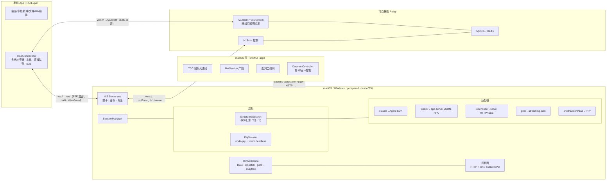

# Prospero 技术总览

> 本文是对**当前代码库**的权威技术参考，区别于 `architecture-exploration.md`（早期探索定稿）。
> 所有符号名、常量、状态值均来自源码实读，以源码为准；若与旧文档冲突，以本文与源码为准。
>
> 生成时间：2026-08-14 ｜ 版本：`0.0.13` ｜ 协议版本：`PROTOCOL_VERSION = 13`

---

## 1. 项目概览

Prospero 把 iPhone / Android 变成 Mac / Windows 上**所有 Coding Agent 的遥控器**。Agent 继续在本机运行
（复用仓库、工具链、账号与登录状态），手机可通过 **LAN / WireGuard 直连**，也可在直连不可用时通过
可自托管 relay；两条路径都使用同一条端到端加密会话。

核心差异化：**LAN/WG 直连优先 + 可自托管 relay + 跨 agent 统一入口 + 应用层 E2E**。

- **仓库形态**：npm workspaces monorepo（`apps/*` + `packages/*`），Node ≥ 22，TypeScript strict，MIT。
- **运行时组件**：
  | 组件 | 路径 | 技术栈 | 职责 |
  |---|---|---|---|
  | daemon | `apps/daemon` | Node 22 + TS | 电脑上的常驻服务：会话、适配器、编排、WS/控制面 |
  | mobile | `apps/mobile` | React Native 0.86 + Expo SDK 57 | 手机客户端：会话/审批/终端/文件/Git/编排 |
  | shell | `apps/shell` | SwiftUI（macOS 14+） | 菜单栏/窗口壳：TCC 归属、Bonjour、QR、daemon 生命周期 |
  | protocol | `packages/protocol` | TS + zod + tweetnacl | 共享协议：消息 schema、E2E 握手、QR、ring buffer |
  | relay | `apps/relay` | Node 22 + MySQL 8.4 + Redis 7.4 + Caddy | 可自托管的 relay v1 控制面与透明数据面 |
  | tools | `tools/` | 脚本 | `fix-node-pty-darwin-helper.mjs`（postinstall 修补） |

---

## 2. 顶层架构



关键点：

- 手机与 daemon 之间只有**一条加密 WebSocket**（`/ws`）；终端 WebView、文件、Git、编排全部复用这条连接。
- daemon 内部还有第二条边界：**控制面**（HTTP 回环 + Unix domain socket RPC），供本机 shell / 会话内
  worker CLI 使用，与手机 WS 分开鉴权。

---

## 3. 仓库结构与模块职责

```
apps/
  daemon/src/
    cli.ts                  # prosperod 入口：start / pair / notify / rotate-key / revoke / status
    ws-server.ts            # WS 服务：握手、鉴权、能力协商、背压、撤销
    session-manager.ts      # 会话总控：创建/恢复/kill/持久化
    structured-session.ts   # 结构化轨：事件日志、快照/续传、审批/提问、附件
    pty-session.ts          # PTY 轨：node-pty + headless 快照 + ring 续传
    agents.ts               # agent 命令构造、能力判定（structuredCapable / defaultKindFor）
    adapters/               # claude / codex / opencode / grok + diff + types
    approval-policy.ts      # strict / standard / yolo
    composer-context.ts     # @文件 / $Skill 补全与解析
    pairing.ts              # 身份/设备/配对载荷（identity.json / devices.json）
    relay-host-client.ts    # outbound relay 控制、快照同步和独立数据 socket
    discovery.ts            # 候选地址枚举 + mDNS 广播
    control-socket.ts       # 本机 Unix socket NDJSON RPC
    notify.ts               # Bark / ntfy 推送
    git-ops.ts / fs-ops.ts  # Git 与文件操作（路径约束）
    agent-accounts.ts       # 账号与 API Profile 凭据
    local-conversations.ts  # 本地历史会话搜索
    host-stats.ts / tmux.ts / status-file.ts / version.ts
    orchestration/          # DAG 编排 + esaytree（见 §8）
    orchestration-cli.ts    # 会话内 `prospero` CLI
    esaytree-cli.ts         # esaytree 独立 CLI
  mobile/src/
    app/                    # Expo Router 文件式路由（含 app/host/[hostId]/…）
    components/             # ChatView / Terminal / KeyBar / DiffView / …
    lib/                    # connection / store / hosts / discovery / …
  shell/
    Package.swift           # SwiftUI 壳（Sources/ProsperoShell/*.swift）
packages/protocol/src/      # messages / schemas / crypto / qr / ring / b64 / utf8 / errors
apps/relay/                 # relay 服务、迁移、Compose/Caddy、审计与容量证据
```

---

## 4. 协议层（`packages/protocol`）

### 4.1 消息模型

- **无统一 envelope**：每条消息是带 `type` 字段的顶层对象，用 `z.discriminatedUnion("type", ...)` 组成
  `C2SMessageSchema` / `S2CMessageSchema`，由 `parseC2S(v)` / `parseS2C(v)` 解析（zod 校验 + 跨字段约束，
  失败抛 `ProtocolError(..., "format")`）。
- **方向命名**：C→S 用动作名（`session.create`、`permission.respond`）；S→C 多用名词或 `.result`/`.ok`
  （`hello.ok`、`git.status.result`）。
- **序号**：PTY 轨用 `seq`（`term.output`/`term.snapshot`，`term.ack` 回执做背压）；结构化轨用 `evSeq`
  （`agent.event`/`chat.snapshot`）；`session.attach` 带 `lastSeq`/`lastEvSeq` 实现断线续传。
- **结构化事件**：`agent.event` 外层包装，内层 `AgentEventBodySchema` 再用 `kind` 做二次 discriminatedUnion，
  共 14 种：`user.message`、`text.delta`、`reasoning.delta`、`tool.start`、`tool.end`、`permission.request`、
  `permission.auto`、`permission.resolved`、`question.request`、`question.resolved`、`subagent.started`、
  `subagent.updated`、`turn.end`、`agent.error`。

### 4.2 版本与能力协商

- `PROTOCOL_VERSION = 13`；兼容窗口 `[13,12,11,10,9,8,7,5]`，`MIN_PROTOCOL_VERSION = 5`；客户端从新到旧回退尝试。
- `CRYPTO_VERSION = 1`（只有密码学帧不兼容才升级）；`PAIRING_FORMAT_VERSION = 7`（QR 载荷版本，与应用协议解耦）。
- **能力开关**（13 个 `CAPABILITY_*` 常量）随 `hello.ok` 下发，例如 `orchestration.snapshot.v1`、
  `orchestration.manual.v1`、`orchestration.worktrees.v1`、`subagent.history.v1`、`agent.accounts.v1`、
  `session.create.model.v1`、`agent.api.profiles.v1`、`chat.attachment.previews.v1` 等。服务端按
  `protocolVersion` + 设备能力（`allowShell` / `canDeviceOrchestrate`）组合下发。
- **WS 关闭码**（应用私有区间 4000–4999）：`CLOSE_AUTH_FAILED = 4001`、`CLOSE_PROTOCOL = 4003`、`CLOSE_REVOKED = 4004`。

### 4.3 消息清单（概览）

- **C→S（约 68 个 type）**：`hello`；`session.create/attach/interrupt/kill`；`term.input/resize/ack`；
  `chat.send/queue.remove/queue.guide/complete/attachment.get`；`launch.models.get`、`agent.models.get`、
  `agent.model.set`、`agent.modes.get`、`agent.mode.set`、`agent.compact`；`tool.output.get`、
  `permission.respond`、`question.respond`、`subagent.send`、`subagent.history.get`；`approval.policy.set`；
  `agent.accounts.*`、`conversation.search`；`workspace.list`；`fs.*`（list/read/write/get/put/mkdir/remove/rename）；
  `git.status/diff/stage/discard/commit`；`usage.get`；`orchestration.*`（snapshot、gate.resolve、run/task/worker/
  graph/automation/worktree 一系列）。
- **S→C（约 29 个 type）**：`hello.ok`、`session.state`、`term.snapshot/output`、`agent.event`、`chat.snapshot`、
  `permission.request`、`error`、`workspace.listing`、`fs.*`、`git.*`、`usage.result`、`orchestration.snapshot` 等。
- 文件路径统一经 `relPath` 约束：拒绝绝对路径与 `..` 段。

### 4.4 加密握手（`crypto.ts`，tweetnacl）

**三帧握手，前向保密**：信任锚是配对 QR 里的 daemon 静态 X25519 公钥 + token；会话密钥由**双方临时密钥**
DH 派生，daemon 静态密钥只做身份证明（泄漏也解不开历史流量）。

1. C→S：`{v, eph}`（客户端临时公钥，明文；v8+ 附 `cv`/`minV`/`maxV`）。
2. S→C：`{seph, p}`（daemon 临时公钥 + 身份证明 `p = box("PRSP"‖cv‖protocolVersion‖seph‖eph, 静态密钥 × eph)`，
   用固定全零 nonce `PROOF_NONCE`，常数时间 `equalBytes` 校验）。
3. C→S：`{c}`（此后全部加密），首帧是 `hello`（含 token）。

- 会话密钥 `= nacl.box.before(serverEph, ephSecret)`；数据帧格式 `{"c":"<b64密文>"}`。
- **nonce 为隐式计数器**：`nonceFor(dir, counter)`，`DIR_C2S=1`、`DIR_S2C=2`（方向字节 + 8 字节大端计数器），
  依赖 WS/TCP 保序不传输；计数器错位/篡改/重放 → `nacl.box.open.after` 失败断连。
- 关键符号：`class SecureChannel { seal/open }`；`clientHandshakeStart/Finish`、`serverHandshakeRespond/Accept`；
  `ProtocolErrorCode = "format" | "crypto" | "version" | "untrusted"`。
- `b64.ts`/`utf8.ts` 为纯 JS 实现：RN(Hermes) 无 Buffer，`atob/btoa` 对二进制不可靠；优先 `TextEncoder/TextDecoder`。

### 4.5 错误模型

- **协议层** `ProtocolError`：`format` / `crypto` / `version` / `untrusted`。
- **应用层**（`S2CErrorSchema.code`）：`auth_failed`、`not_paired`、`shell_not_allowed`、`session_not_found`、
  `agent_unavailable`、`bad_message`、`conflict`、`forbidden`、`denied`、`fs_error`。
- **daemon 侧**：`SessionError`、`FsError`（`not_found/denied/too_large/not_a_file/io`）、`AgentAccountError`、
  `OrchestrationError`（`revision_conflict/operation_conflict/task_not_editable/run_not_deletable/
  invalid_transition/task_not_dispatchable/gate_not_found`）、`ControlSocketError`。若干 code 在 WS 边界被归一化
  为 `conflict`/`bad_message`；`ProtocolError("crypto")` 直接 `close(CLOSE_PROTOCOL)`。

---

## 5. 连接、发现与安全

### 5.1 配对与地址发现

- **存储目录** `~/.prospero`（`PROSPERO_HOME` 可覆盖，0700）：`identity.json`（daemon 静态密钥对）、
  `devices.json`（已配对设备）、`config.json`（`{port}`）、`control.token`（0600）、`orchestration.json` 等。
- **默认端口** `7423`。配对 `pair --name <dev>` 铸设备（token = base64url 24 字节随机数）并生成 QR。
- **QR 载荷**（`prospero://pair?d=` + base64url JSON）：`{v, name, addrs[], port, token, pubKey, relay?}` ——
  `addrs` 一次带齐所有网卡候选地址（en0 + utun* 等）；可选 `relay` 携带独立的 route/device/token，
  不会复用 E2E token。客户端并发竞速。
- **发现三层**：mDNS（`_prospero._tcp`，仅同广播域）→ QR 配对 → 客户端地址簿记忆。
- `hostIdForDaemonPublicKey(pubKey)`：取公钥前 16 字符做稳定主机 ID（路由与深链共用）。
- `candidateAddrs()`：只取 IPv4 非 internal，过滤 RFC2544（198.18/19）、link-local（169.254）与 `.0` 网段地址；
  排序 `en*` → `utun*`（WireGuard）→ 其他。

### 5.2 服务端鉴权与审计（`ws-server.ts`）

- 握手成功后解出 `hello`，调 `pairing.authenticate`：token 用 `timingSafeEqual` 比较 + **TOFU 公钥绑定**
  （首次记录 `clientPubKey`，之后公钥变化即拒）。失败仅记录 daemon 侧（token 前 6 字符 + 原因），客户端只收模糊文案。
- **撤销即时生效**：`dropRevokedConnections()` 对比设备表，不在表内即发 `error{code:"auth_failed"}` 并以
  `CLOSE_REVOKED` 断开；`fs.watch(home)` 盯目录（150ms 防抖）。
- **`--dev` 明文通道**：仅 loopback，devToken 每次启动重生成、只打印在启动终端。
- **背压**：`HIGH_WATER = 512KB`、`LOW_WATER = 64KB`、`CATCHUP_MS = 250`、`PING_MS = 15s`。`bufferedAmount`
  超阈值时暂停，`catchupTimer` 周期用 `ring.since` 追平，gap 淘汰则回全量快照。

### 5.3 控制面（本机边界）

- **HTTP**：`/_prospero/control/*`（health、session 查看/交互、orchestration action、gate resolve、kill/interrupt），
  仅 loopback + `Bearer controlToken`。控制 token 代表宿主机用户本人（`allowShell: true`），不继承手机设备限制。
- **`control-socket.ts`**：Unix domain socket（Windows 命名管道）+ NDJSON，`ControlRequest/ControlResponse`
  模型，`MAX_LINE_BYTES = 1MB`，默认 15s 超时。供 shell 与**会话内 worker CLI** 使用。

### 5.4 通知（`notify.ts`）

App 不在前台（iOS 挂起后 WS 断）时的锁屏通道：**Bark / ntfy** 统一成一个 URL 模板（POST JSON）。
`DEFAULT_THROTTLE_MS = 30s`，按 key（通常 sessionId）节流；只推元数据摘要（`会话标题需要批准` + action），
**不推命令输出/文件内容**。触发点：`permission.request` 且 `delivered === 0`（无客户端在看）；`permission.resolved` 时清除。

### 5.5 Relay（直连的 E2E 传输后备）

- **三 socket 约定**：daemon 的 `/v1/host` 只承载 JSON 控制；手机 `/v1/client` 与 daemon `/v1/stream`
  在双方收到 `stream.ready` 后一对一透明转发 SecureChannel 数据。relay 不解密、解析、压缩或重组应用帧。
- **凭证与状态**：host secret、配对 E2E token、relay device token 与一次性 stream ticket 各自独立。MySQL/Redis
  仅存域分离 digest；ticket 的 Redis key 也经过域分离 hash，持久值不含 raw ticket。断依赖、鉴权失败、过期或
  重放一律 fail-closed。详见 [relay-design.md](relay-design.md) 和 [relay-security-audit.md](relay-security-audit.md)。
- **默认 URL 注入**：daemon 仅从自身进程环境读取 `PROSPERO_DEFAULT_RELAY_URL`；`config.json` 中显式 `relay.url`
  优先。发布包或服务管理器应在启动 daemon 时注入 `wss://` URL，绝不把 URL 或任何秘密编入手机包或 QR 之外的日志。
  `prosperod relay enable` 可使用该默认值，`--url` 仅写本机 override；`ws://` 只允许 `--dev` 的 loopback。
- **三种手机模式**：`direct` 仅尝试 QR 地址；`relay` 仅尝试 QR 中的 relay 凭证；`auto` 同时竞速所有可用路径，
  第一个完成 E2E `hello.ok` 的路径获胜。旧 QR/旧地址簿保持 direct；要获得 relay 凭证须重新扫码。
- **部署边界**：仓库提供可部署的 Compose/Caddy 制品和 runbook，未在本次交付中声明或验证真实公网 DNS、TLS/WSS 部署。

---

## 6. Daemon 会话层

### 6.1 SessionManager 与生命周期

`SessionManager`（`EventEmitter`）持有两张表：`ptySessions: Map<string, PtySession>`、
`structuredSessions: Map<string, StructuredSession>`；对外事件 `output` / `agentEvent` / `state`。

- **创建** `create(CreateSessionInput)`：校验 `requiresShellCapability`（仅 shell/custom 需 `allowShell`）、
  `structuredCapable`（opencode/claude/codex/grok）、`resume/mode/model/effort` 的 agent 限制；按 `kind` 分支到
  结构化或 PTY。`defaultKindFor`：grok→`pty`，其余 structuredCapable→`structured`。
- **恢复**：PTY 走 tmux（`restoreFromTmux`，元数据 `pty-sessions.json` ∩ tmux session）；结构化走
  `restoreStructured`（`structured-sessions.json`，`version===1` 严格校验，`preserveHistoryWhen` 命中则封存为只读历史）。
- **状态** `SessionStatus`：`starting | running | waiting_approval | waiting_input | idle | completed | done | died`。
- **kill**：结构化先 `dispose()` 标 `done` 只读，`preserveHistory` 时立即落盘；PTY 关 client 并 `tmux.killSession`
  （tmux 托管下关 client ≠ 杀进程）。`disposeAll()` 先 `flushPersistence()`，tmux 托管下最多等 750ms 让子进程登记，
  之后 dispose 但**不 killSession**（进程留在 server 里）。
- **持久化**：结构化 `scheduleStructuredPersist()`（200ms 防抖）写 `structured-sessions.json`；PTY `persistMeta()`
  写 `pty-sessions.json`；均为 `.tmp` + `renameSync`、`0600`。

### 6.2 双轨模型

**结构化轨 `StructuredSession`**：以**事件日志**持有对话状态（对位 PTY 的画面状态）。`record(body)` 递增 `evSeq`、
维护预览与状态机；`snapshot()` / `since(afterSeq)` 提供完整持久日志与增量续传（历史截断返回 null 触发全量）。无法
增量续传的 `session.attach` 则使用 `transportSnapshot()`：连续同消息的文本/推理增量合并，子 Agent 的多次更新折叠为最终状态，摘要仅保留
220 字符预览；完整历史仍可按需读取。写入、恢复和出线前会把子 Agent `summary` 限为 `10000` 字符，以确保 `chat.snapshot`
始终符合协议 schema。`evSeq` 继续代表未压缩日志的权威序号。
常量：`MAX_EVENTS=4000`、`MAX_MESSAGE_QUEUE=50`、`PREVIEW_CHARS=140`、`MAX_TOOL_OUTPUT=200000`。
`send()` 在 busy 时按 `delivery`（`auto|queue|steer`）排队或引导；附件落盘到 `~/.prospero/attachments/<sid>/` 并按需分块。

**PTY 轨 `PtySession`**：`node-pty` 跑真实进程 + `@xterm/headless` 持有画面 + `@xterm/addon-serialize` 秒开快照 +
输出合帧（`FLUSH_MS=16`）入 `OutputRing` 分 seq 续传。**必须应答终端查询**（Claude Code(Ink)/crossterm 等否则挂起）：
DSR `CSI 6n`→`ESC[{y};{x}R`、DA1→`ESC[?6c`、OSC 10/11 颜色查询；输入按 `INPUT_CHUNK=1024` 分片防 PTY 死锁。

**Ring buffer `OutputRing`**：`capacityBytes = 1MB`，`seq` 从 1 单调递增；`since(lastSeq)` 返回增量，进度超前或
gap 已淘汰时返回 null（调用方回全量快照）。

### 6.3 Agent 适配器矩阵

通用接口 `AgentAdapter`（`adapters/types.ts`）：必选 `respondPermission`，可选 `acceptsImages`、
`acceptsSkillInputs`、`start/send/steer/setApprovalPolicy/listModels/setModel/listModes/setMode/compact/
sendToSubagent/readSubagentHistory/respondQuestion/usage/interrupt/dispose`。

| Agent | 通道 | 审批回传 | 恢复 | 备注 |
|---|---|---|---|---|
| **claude** | `@anthropic-ai/claude-agent-sdk` `query()`（进程内，流式输入） | `canUseTool` 回调挂起 promise；`suggestions` 作为 `updatedPermissions` 回传 | `sessionId` → `resume` | `acceptsImages=true`；compact 推 `/compact` 等 `status.compact_result` |
| **codex** | `codex app-server` 子进程 + JSON-RPC 2.0 over stdio | server→client 请求（command/fileChange/permissions 审批），客户端回 response | `threadId` → `thread/resume` | `acceptsSkillInputs=true`；sandbox：YOLO→`danger-full-access`，否则 `workspace-write` + `writableRoots:[cwd]` |
| **opencode** | daemon 托管共享 `opencode serve`（HTTP+SSE） | `POST …/permission/:id/reply` | `sessionId` → 重订阅 SSE | 无 model/mode 接口；端口先于 model catalog 就绪（约 1.4s），须等 catalog |
| **grok** | 每轮 spawn `grok -p … --output-format streaming-json` | 仅粗粒度 `--always-approve`，`respondPermission` 为 no-op | `--session-id` / `--resume` | 默认 PTY 轨；显式 structured 即自动批准并 emit `agent.error` 告知 |
| **shell/custom/trae** | 无适配器，纯 PTY（`agents.ts::commandFor`） | TUI 内交互 | tmux / 无 | claude/codex 的 PTY 命令带 `--dangerously-skip-permissions` / `--dangerously-bypass-approvals-and-sandbox` |

`adapters/diff.ts`：行级 LCS 合成审批/工具卡片 diff（`MAX_PATCH_CHARS=8000`），支持 Claude Write/Edit/MultiEdit
工具输入与 Codex unified patch。

### 6.4 审批策略（`approval-policy.ts`）

- `strict`（默认，每次询问）/ `standard`（`READ_ONLY` 白名单自动放行，**未知工具一律需审批**，保守方向）/ `yolo`（全部批准）。
- 白名单跨 agent 统一小写：`read/grep/glob/ls`（Claude）+ `read_file/list_dir/search/codebase_search/git_diff/git_status` 等。
- 会话内可 `setApprovalPolicy`；切到 `yolo` 时立即放行已卡住的审批（`respondPermission("once")`）。

### 6.5 支持性模块

- **`git-ops.ts`**：只在会话 cwd、路径经 `resolveWithin` 校验、一律 `--` 分隔、`MAX_OUTPUT=2MB`、`LC_ALL=C`。
  status 用 porcelain v1 `-z`；未跟踪文件 diff 用 `diff --no-index` 构造全新增视图；commit 返回短 hash。
- **`fs-ops.ts`**：`resolveWithin` 用 realpath 解符号链接后 `contains` 比对，防 `..` 与 symlink 逃逸；
  编辑上限 1MB、目录上限 2000 项、分块传输 1MB；只删空目录，拒绝删会话根。
- **`agent-accounts.ts`**：账号元数据 `agent-accounts.json`；凭据存账号目录 `0700` 下 `0600` 的
  `.prospero-credential.json`；macOS 一次性只读迁移旧 Keychain；`AccountBinding` 注入隔离环境
  （Codex→`CODEX_HOME`，Claude→`CLAUDE_CONFIG_DIR` + 哨兵防回退全局 Keychain）；第三方 API Profile 经
  `codexProviderArgs` / `ANTHROPIC_BASE_URL`。
- **`composer-context.ts`**：`@文件`（BFS 索引 + 子序列模糊匹配，`MAX_INDEX_ENTRIES=20000`）与 `$Skill` 补全；
  无原生 Skill input 的 agent 注入完整 SKILL.md。
- **`local-conversations.ts`**：codex 走 app-server `thread/search`；claude 走 `CLAUDE_CONFIG_DIR` 下 jsonl 或 SDK `listSessions`。
- **`host-stats.ts`**：darwin 用 `sw_vers` 取人读系统名、`vm_stat` 算可用内存（对齐活动监视器）。
- **`tmux.ts`**：`new-session -A` 托管（存在即 attach）；环境显式 `-e` 带入；`history-limit 10000`；未装 tmux 静默回退直接 spawn。

---

## 7. 编排（orchestration）

> 目录 `apps/daemon/src/orchestration/`；详细契约见 `docs/orchestration-handoff.md`。

### 7.1 数据模型（`model.ts`）

- **`Run`**：一次编排（`active | completed | abandoned`），含 `coordinatorSessionId`、`graphRevision`、
  `automation?`、`coordinatorPrompt?`。
- **`Task`**：DAG 节点。`deps: string[]` 是依赖边；`parentId` 是层级父节点（非依赖）。
  **`ready` 是派生值，永不落盘**：`isReady(task, all) = status==="pending" && 所有 dep 为 done`；被 `cancelled` 的
  依赖不放行（需人显式改依赖）。建任务/改依赖时用三色 DFS `findCycle` 成环检测。
- **`Dispatch`**：一次 worker 派发，`sessionId` 是持久 Prospero 会话 id。
- **`Message`**：编排邮箱（`note|ask|reply|report`）。
- **`Gate`**：决策门（`pending | resolved | cancelled`），可挂 task（置 `blocked`）或 run 级。
- **`WorktreeAsset`**：工作树资产账本（`runId` 是 owner 不可变 id 而非外键，Run 删除不删资产）。

**Task 状态机**（`TASK_TRANSITIONS`）：`pending | dispatched | blocked | done | failed | cancelled`。
`done` 是硬终态（要改就新建任务）；`failed` 唯一可重试回 `pending`；转移只认显式转移，绝不从
adapter 的 `SessionStatus`（idle 等）猜 done。

**Dispatch 状态**：`starting | running | succeeded | failed | abandoned`（settled 落 `settledAt`）。

### 7.2 派发与恢复（`dispatch.ts`）

`startWorker` 顺序严格：校验 ready → 建 worktree（`new` 时先登记资产再建会话）→ 继承账号 → `sessions.create`
→ `createDispatch`（**先于前导词落盘**，防止 `task done` 抢在归属记录前）→ 发 worker 前导词（含交付命令
`prospero --session <sid> task done/fail --id …`）→ `running`。

**恢复对账** `reconcilePersistedSessions()`（启动顺序不可调换：control socket → SessionManager →
对账 → 自动队列/Goal 重试）：
- 会话的真正终态只有 `done | died`；`completed` 是结构化会话的一轮结束，和 `idle`、
  `waiting_*` 一样仍可接收 chat、持有 writer 租约。`infoOf` 缺失等同真正终态。
- 非 active 但会话仍活（含 `completed`）→ 显式终止并归档已交付 worker，防止恢复后旧队列写回；
- active 但会话缺失/真正终态 → 收敛为 `abandoned + failed` 并保留原因；
- `starting` 但会话存活（含 `completed`）→ 标回 `running`（不重复派发）。

**收敛（settle）**：`settleWorkerDelivery` 是同步持久化提交点——Task、Dispatch、关联 worktree 资产在同一
快照里收敛再原子写，返回后才允许 kill 真实会话。`restoreStructured` 有两道封存闸门防止旧队列在恢复窗口内
发送已交付任务。

### 7.3 自动化（`automation.ts`）

`RunAutomation{state: running|paused|completed, workspace: run|current, agent, approvalPolicy, cwd, workspacePath, branch}`。
`workspace:"run"` 建整图共享隔离 worktree（`prospero/<runId>/auto-<stamp>`），worker 用 `worktree:"none"` +
`cwd=workspacePath` **串行推进**（下游天然看到上游写入；自动 merge 具备后才并行）。

### 7.4 邮箱协作（`collaboration.ts`）

`mail.send / check(--wait 长轮询) / ask(阻塞等 reply) / reply`。`ask/reply` 经 `threadId` 串成问答；`answeredAt`
只落一次；reply 只能由原收件人回给原提问者。

### 7.5 esaytree 工作树隔离

快速路径：`git worktree add --no-checkout` → `FICLONE_FORCE` CoW 复制源工作区（跳过根 `.git`）→
`restoreCommittedSnapshot`（`git reset --mixed` + `clean -ffdx` + 按目标 ref 还原）→ 复用 ignored 目录
（`node_modules` 等整目录折叠）。CoW 失败退回普通 checkout。`rollbackCreatedWorktree` 保证创建失败无残留。
默认根 `<repo>/.prospero-worktrees/<repoBasename>/<name>`（`ESAYTREE_ROOT` 可覆盖）。

**资产检查/清理（`worktree-assets.ts`）**：`inspect` 只读，结论 `missing|dirty|unmerged|equivalent|safe_to_clean|…`；
`cleanup` 多重保护：必须 `confirm` → 删除前**无条件重新 inspect** → live lease 检查 → `git worktree remove --force=false`
第二道门 → 分支 compare-and-delete。**默认保留工作树，绝不自动删目录**，只接受显式 cleanup。

### 7.6 持久化（`store.ts`）

单 JSON 文件 `orchestration.json`（`version:2`，不上 SQLite）。内存是真相、盘是快照：变更同步改内存 +
`schedulePersist()`（200ms 防抖）异步落盘，`.tmp.<pid>` + `renameSync`（0600）。v1→v2 迁移保守登记 legacy 资产
（只补登记不碰磁盘）。幂等操作 `rememberOperation(operationId, fingerprint, result)`（sha256 of method+canonicalJson）
防重复提交与并发冲突。

---

## 8. CLI 全景

### 8.1 `prosperod`（daemon，`cli.ts`）

| 命令 | 说明 |
|---|---|
| `start`（默认） | 启动 WS 服务 + Bonjour。选项 `-p/--port`、`-b/--bind`、`--dev`、`--no-bonjour`、`--tmux`、`--name` |
| `pair` | 铸设备并打印配对 QR。`--name`、`--no-shell`、`--no-orchestration` |
| `relay enable [--url <wss-url>]` | 启用 host 到 relay 的注册；未提供 URL 时读取 `PROSPERO_DEFAULT_RELAY_URL` |
| `relay disable` / `relay status [--json]` | 停止注册但保留本机配置 / 查看公开状态与需要重新配对的设备数 |
| `relay rotate-key --yes` | 轮换 host route key；既有 relay 凭证失效，所有设备必须重新扫码；直连配对仍有效 |
| `notify` | 配置 Bark/ntfy 推送。`--url`、`--off`、`--test` |
| `rotate-key` | 更换 daemon 身份密钥（`--yes`，所有设备重配） |
| `revoke <name>` | 撤销设备并断开连接 |
| `status` | 打印 home、身份公钥、端口、监听、候选地址、已配对设备 |

### 8.2 会话内 `prospero`（`orchestration-cli.ts`）

纯 socket client（不把编排状态存进 agent 进程），走 `controlRequest` NDJSON RPC。全局 `--socket`、`--token-file`、
`--session`（默认 `PROSPERO_SESSION_ID`）。子命令：`run create/list/complete/abandon`、
`task create/list/done/fail/retry/cancel`、`worker start/stop`、`worktree list/inspect/cleanup`、
`send/check/ask/reply`、`gate create/resolve/list`、`status`。
交付命令：`prospero --session <sid> task done --id <taskId> --body "..."`。

`prospero status` 默认以当前 `PROSPERO_SESSION_ID` 选关联 Run（coordinator 或该 worker 的 dispatch），优先 active，
再按最近更新的历史 Run。它输出紧凑 JSON：Run 基本态、Task 状态计数和 ready 数、ready Task、活动 worker、pending Gate，
以及可复制的 `nextActions`。动作只显示当前最高优先级的一组：`gate → failed → running → ready → waiting → complete`，避免
低优先级操作掩盖待决 Gate。`--run <id>` 精确选 Run，`--all` 输出所有 Run 的精简摘要；找不到关联 Run 时会输出可执行的
`prospero status --all` / `prospero run create` 提示。`--json` 保留旧版完整原始 snapshot（并忽略 `--run`/`--all`），因此默认
紧凑输出不会带 Task `spec/result`、邮箱消息或 worktree 历史。

恢复/干预命令和控制 API 一一对应：`task retry --id <failed-task> [--operation-id <id>]` 仅适用于 failed Task；
`task cancel --id <task> [--reason <text>] [--operation-id <id>]` 仅取消未运行 Task；
`worker stop --task <task> [--reason <text>] [--operation-id <id>]` 停止运行中的 worker 并将 Task 标为 failed。三者如遇自动
编排正在运行，都会由既有控制 API 先暂停自动编排；取消运行中任务前必须先 stop worker。

### 8.3 `esaytree`（独立 CLI，`esaytree-cli.ts`）

`new/list(ls)/switch/rm/doctor`，支持 `--json`；输出 envelope `esaytree.dev/cli/v1`；退出码约定
（2 参数错 / 3 不存在 / 4 目标冲突 / 5 CoW 缺失 / 6 Git 失败 / 70 内部错误）。

### 8.4 超时（`orchestration-cli-timeouts.ts`）

`worker.start` 5 分钟（`--worktree new` 要同步建树 + 复制 ignored 依赖）；其余 RPC 15 秒；`check --wait`/`ask` 走 `timeoutMs=0`。

---

## 9. 移动端（`apps/mobile`）

- **栈**：Expo SDK 57 / RN 0.86 / React 19 / expo-router（文件式路由）/ zustand / AsyncStorage；strict TS。
- **连接核心 `HostConnection`**（`lib/connection.ts`）：
  - **多地址并发竞速**：`orderedAddrs()`（lastGood 优先）并发建 WS，先完成 E2E 握手者胜；同地址按协议版本从新到旧回退。
  - **三模式 relay 选择**：新 relay QR 默认 `auto`，同时发起 direct 与 relay；`direct`/`relay` 可显式固定。
    relay ticket 保存在 SecureStore，route/device 元数据才可进入 AsyncStorage；缺少 relay ticket 的旧设备必须重新扫码。
  - **重连**：指数退避 400→8000ms；`kick()` 清退避立即连。
  - **心跳**：`HEARTBEAT_MS=10s`、`SILENCE_LIMIT_MS=35s`（RN WS 无 ping/pong，靠最近收包时间判半开）。
  - **离线队列**：`BoundedQueue`（`MAX_OFFLINE_QUEUE=50`）。
  - E2E 全部委托 `@prospero/protocol`（`clientHandshakeStart/Finish` → `SecureChannel`）；密钥存 SecureStore，
    daemon 公钥 TOFU 绑定。
- **状态/持久化**：运行时 `lib/store.ts`（zustand，`sortSessions` 待审批置顶）；地址簿 `lib/hosts.ts`（AsyncStorage）；
  凭据 SecureStore；诊断 `lib/connect-diagnosis.ts`（失败分类 + 可执行提示）。
- **路由**：`/`（主机列表）、`/pair`、`/host/[hostId]`（会话列表 + Goal/账号入口）、`.../edit`、`.../accounts`、
  `.../orchestration`、`.../session/[sid]`（ChatView 或 Terminal+KeyBar）、`.../files/[sid]`、`.../git/[sid]`、
  `.../preview/[sid]`。
- **终端**：`react-native-webview` 内嵌打包好的 xterm.js（`terminal-html.ts`，由 `scripts/build-terminal-html.mjs` 生成）。
  **WS 只在 RN 侧单连接**，WebView 只做渲染与输入；桥协议 `{kind: snapshot/output/input/…}`；`lastSeq` 500ms 聚合回 `ack`；
  重连后 `attach(sid, lastSeq)` 由服务端裁决增量续传或回快照。
- **关键组件**：`ChatView`（事件→条目折叠，含 PermissionCard/QuestionCard/ToolCard/SubagentCard）、`DiffView`、
  `Markdown`/`MathView`（KaTeX）、`KeyBar`（粘滞 Ctrl + Esc/Tab/方向键/`^C ^D ^R …`）、`WorkspacePicker`、
  `VoiceButton`（离线语音，中英混合）、`AgentIcon`、`Toast`。
- **通知**：不依赖推送；提示走本地 Toast；App 后台的审批提醒由 daemon 的 Bark/ntfy 通道承担。

---

## 10. macOS 壳（`apps/shell`）

SwiftPM 可执行目标 `ProsperoShell`（macOS 14+，Swift 6）。**存在的唯一硬性理由：给 daemon 一个能被 TCC 授权的
.app 父进程**（LaunchAgent 直接拉 Node 会踩 `~/Documents` 与本地网络的 TCC 限制）。

- `DaemonController`：以子进程启停/重启 `node apps/daemon/dist/cli.js start --no-bonjour --tmux`；状态机
  `stopped/starting/running(externallyRunning)/failed`；端口探测避免抢占手动起的 daemon；通过回环 HTTP + 每次启动
  轮换的 control token 提供本机控制接口。
- `Pairing`：调 `prosperod pair` 铸设备，CoreImage 渲染 QR（凭证只显示不落盘）。
- `Bonjour`：`NetService` 发布 `_prospero._tcp`（广播从 daemon 挪到壳，TCC 归属 .app）。
- `LoginItem`：`SMAppService.mainApp` 开机自启。
- `scripts/build-app.sh`：`swift build -c release` → 组装 `.app`（Info.plist 写 bundle id 与 Bonjour/本地网络描述）→
  codesign（稳定身份优先，否则 `ALLOW_ADHOC_SIGNING=1`）。

---

## 11. 构建、运行与测试

```bash
# 依赖（postinstall 会跑 patch-package + node-pty darwin 修补）
npm ci

# 构建协议包 + daemon
npm run build -w @prospero/daemon

# 启动 daemon（Mac 终端 / Windows PowerShell）
node apps/daemon/dist/cli.js start --name my-computer --tmux

# 生成配对二维码
node apps/daemon/dist/cli.js pair --name my-phone

# 可选：在 daemon 服务环境已注入 PROSPERO_DEFAULT_RELAY_URL 时启用 relay
node apps/daemon/dist/cli.js relay enable

# 移动端（需要 Xcode / JDK 17 + Android SDK）
npm run ios -w @prospero/mobile -- --device      # iOS 真机
npm run android -w @prospero/mobile              # Android

# macOS 壳
apps/shell/scripts/build-app.sh

# 类型检查 / 测试
npm run typecheck
npm test          # 或 npm run test -w @prospero/daemon（vitest）
npm test -w @prospero/relay
npm run test:e2e -w @prospero/relay  # 需要 Docker
```

- 运行时要求：macOS 14+ / Windows 11、Node.js 22+，至少一个已登录的 Agent CLI。
- daemon 集成测试会拉起真实 agent 子进程，`vitest.config.ts` 设为**串行**执行（并行资源抢占会偶发超时）。
- 测试覆盖：协议（crypto/qr/ring/schemas）、daemon 会话与适配器（claude/codex/grok/opencode 端到端）、
  编排（store/dispatch/recovery/automation/worktree-assets/control-api/collaboration）、esaytree（真实 `git init` 仓库）。

---

## 12. 关键常量速查

| 常量 | 值 | 位置 |
|---|---|---|
| 协议版本 | `13`（兼容 `[13,12,11,10,9,8,7,5]`，最低 `5`） | `protocol/messages.ts` |
| 加密版本 / 配对载荷版本 | `1` / `7` | `protocol/messages.ts` |
| daemon 版本 | `0.0.13` | `daemon/version.ts` |
| relay 协议 / endpoint | `1` / `/v1/host`、`/v1/client`、`/v1/stream` | `protocol/relay.ts` |
| 默认端口 | `7423` | `daemon/pairing.ts` |
| 数据目录 | `~/.prospero`（0700） | `daemon/pairing.ts` |
| mDNS 服务类型 | `_prospero._tcp` | `daemon/discovery.ts` |
| PTY 合帧 / ring 容量 | `16ms` / `1MB` | `daemon/pty-session.ts` |
| 结构化事件上限 | `4000` | `daemon/structured-session.ts` |
| 子 Agent 摘要 / 传输预览上限 | `10000` / `220` 字符 | `protocol/schemas.ts` / `daemon/structured-session.ts` |
| WS 背压水位 | `512KB / 64KB` | `daemon/ws-server.ts` |
| 控制面 RPC 超时 | `15s`（worker.start `5min`） | `daemon/control-socket.ts` / `orchestration-cli-timeouts.ts` |
| 编排持久化 | `orchestration.json`（version 2，200ms 防抖） | `daemon/orchestration/store.ts` |
| 移动端离线队列 | `50` | `mobile/lib/outbound-queue.ts` |

---

## 13. 相关文档

- `docs/architecture-exploration.md` —— 早期探索与决策记录（竞品、选型、踩坑）
- `docs/orchestration-handoff.md` / `docs/orchestration-plan.md` —— 编排契约与规划
- `docs/esaytree.md` —— esaytree 工作树隔离设计
- `docs/relay-design.md` / `docs/relay-security-audit.md` / `docs/relay-release.md` —— relay 契约、审计与交付状态
- `docs/mobile-ux/`、`docs/voice-input-plan.md`、`docs/android-plan.md`、`docs/m1-plan.md` —— 各专题
